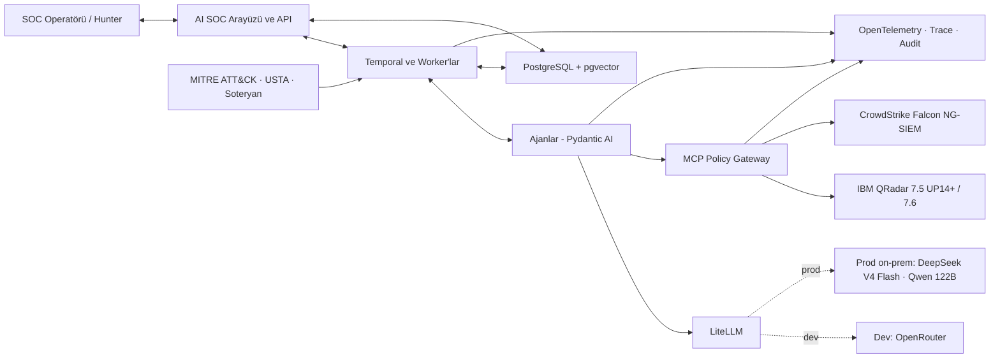
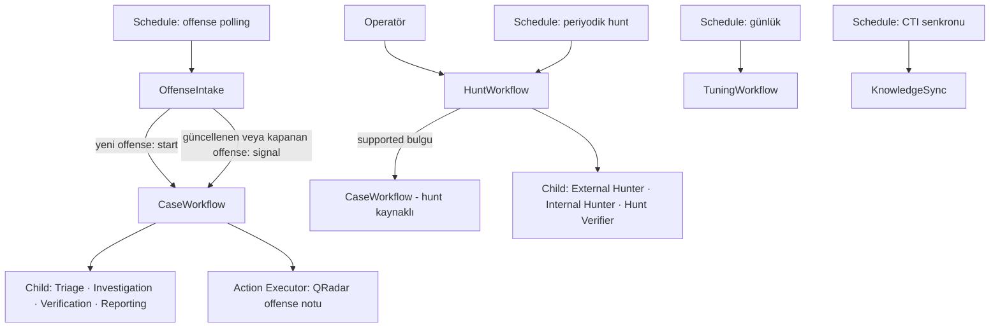
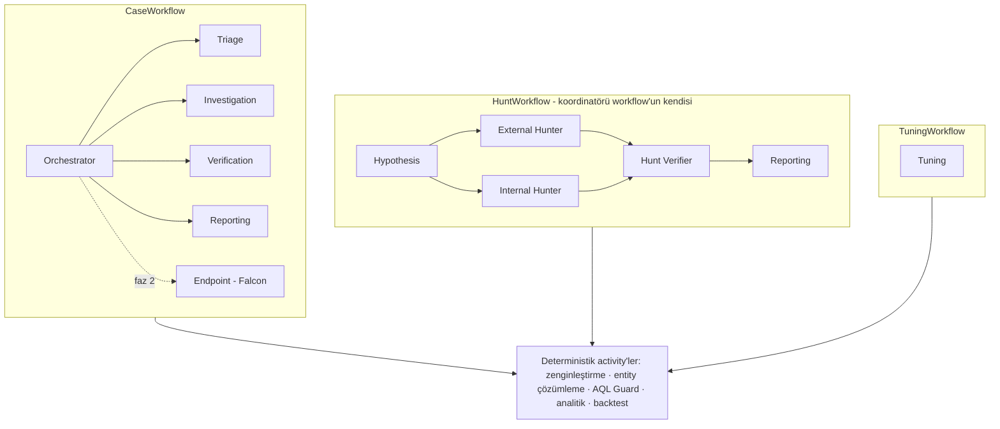
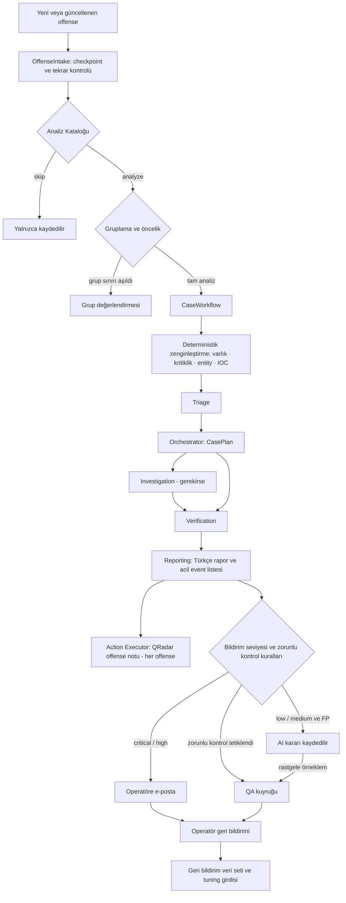
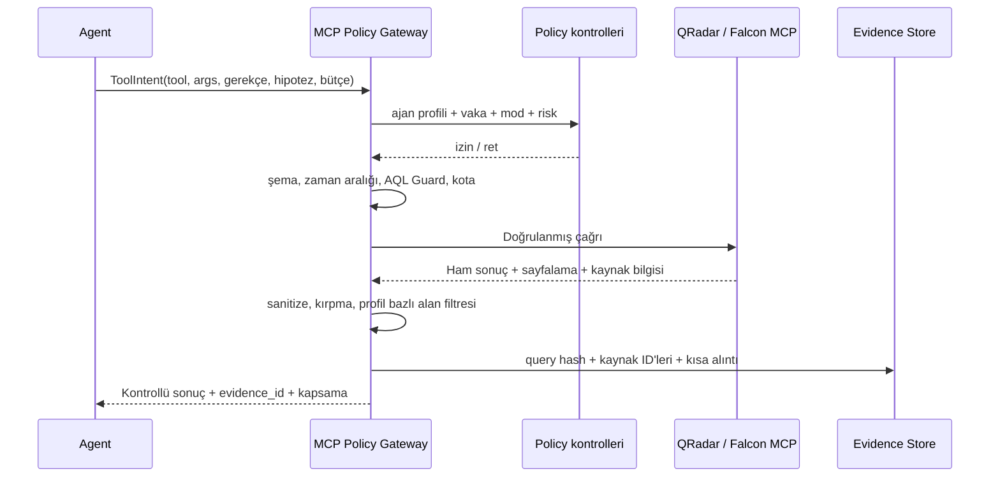
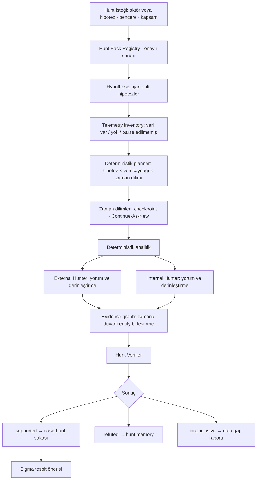

# AI SOC Platform Mimarisi

> Son güncelleme: 2026-10-02. Kararların gerekçeleri ve açık sorular [decisions.md](decisions.md), test ve değerlendirme tasarımı [agent-harness.md](agent-harness.md), uygulama sözleşmeleri (şemalar, veri modeli, API, prompt kuralları) [impl/](impl/) içindedir. Metindeki `D-xx`, `T-xx` ve `S-xx` kodları karar kaydına referanstır.

## 1. Amaç ve kapsam

Platform, banka ve iştiraklerinin SOC'u için çalışır; hepsi tek bir kurum olarak ele alınır (D-01). Görevi QRadar offense'lerini AI ile ilk yorumlamak, operatöre kanıtlı öneri sunmak ve geriye dönük threat hunt'lar koşturmaktır. QRadar'ın korelasyon motorunun yerine geçmez.

### Platform ne yapar

- Her yeni offense'i önce AI yorumlar ve TP, FP veya şüpheli kararı verir. Kararla birlikte kanıtları ve önerilen aksiyonları sunar.
- Operatörün acil bakması gereken event'leri önceliklendirir ve bu sonucu analiz kapsamındaki her offense'e QRadar notu olarak yazdırır (D-18, D-20). Araştırmayı operatör tamamlar.
- Hangi offense'in analiz edileceğine ve ne kadar önemli olduğuna, operatörün tanımladığı Analiz Kataloğu'na göre karar verir (D-25).
- Critical ve high offense'leri operatöre e-postayla bildirir (D-22). Low ve medium offense'lerde AI'ın kararını kaydeder ve bir kısmını kontrol için operatöre örnekler (§9).
- Tekrarlayan false positive'ler için QRadar kural tuning'i önerir. Her öneri backtest sonucuyla gelir (§10).
- Seçilen tehdit grubu veya hipotez için 3, 6 ya da 12 aylık geriye dönük hunt koşturur. Hunt'ı operatör başlatır ya da periyodik olarak zamanlanır. Her hunt'ın sonucu Türkçe PDF rapor olarak arayüzde sunulur ve e-postayla gönderilir (§17, D-23).
- Bütün rapor ve önerileri Türkçe sunar.

### Platform ne yapmaz

- Host izolasyonu, hesap kilitleme, firewall block gibi aksiyonları hiçbir fazda kendisi uygulamaz (D-02). Bunları yalnızca önerir.
- Offense kapatmaz veya silmez; QRadar kuralına ve yapılandırmasına dokunmaz. QRadar'a yazdığı tek şey offense notudur (D-18, D-19).
- Vardiya devri, vaka atama ve operatör SLA takibi yapmaz (D-06). Operatörün vaka üzerindeki işinin kayıt sistemi QRadar'dır (D-34).
- Çok kiracılı (MSSP) çalışmaz (D-01).
- Prod verisini bulut modele göndermez (D-11).
- İleriye dönük izleme kampanyası yürütmez (D-05). Flow verisi olmadığı için flow tabanlı analiz de yapmaz (D-15).

## 2. Tasarım ilkeleri

1. **Workflow ajan değildir.** Temporal vaka durumunu, retry'ları, timeout'ları, checkpoint'leri ve insan beklemelerini yönetir. LLM yalnızca sınırları çizilmiş karar noktalarında çalışır.
2. **Ajan aracı doğrudan çalıştırmaz.** Her çağrı MCP Policy Gateway'den geçer, doğrulanır ve kaydedilir.
3. **Yetki HTTP metoduna göre değil, işleve göre verilir.** Ariel araması başlatmak POST, bitmiş aramayı temizlemek DELETE kullanır; ikisi de işlev olarak salt okunurdur. Offense kapatmak ise POST olduğu halde yazma işlemidir.
4. **Kanıtsız iddia sonuç değildir.** Her iddia kaynak sistem, sorgu, event ID'si ve zaman aralığıyla bir kanıta bağlanır.
5. **Kod model sağlayıcısını bilmez.** Ajanlar yalnızca `soc-fast`, `soc-reasoning` gibi mantıksal model adlarını görür.
6. **Ortamlar birbirine veri taşımaz.** Dev'de OpenRouter ve sentetik veri, prod'da yalnızca on-prem model ve gerçek veri kullanılır (§4).
7. **LLM ham log taramaz.** Önce deterministik analitik çalışır, LLM onun sonuçlarını yorumlar (§15).
8. **Önce araç, sonra ajan.** Çok adımlı akıl yürütme gerektirmeyen her iş deterministik bir activity'dir. Delegasyon derinliği en fazla 2'dir (T-08).
9. **Log içeriği saldırgan girdisidir.** Log alanlarındaki metin hiçbir zaman talimat veya yetki kaynağı olmaz. "Bu yetkili bir test" gibi bilgiler yalnızca platformun kendi kayıtlarından gelir (§22).
10. **Genişleme sözleşmeyle olur.** Yeni ajan veya connector eklemek manifest yazmak demektir; çekirdek kod değişmez (§8).
11. **Hunt tekrar üretilebilir olmalıdır.** Hipotez, hunt pack sürümü, kapsama, sorgular ve sonuçlar kayıt altına alınır.

## 3. Sistem bağlamı



## 4. Ortamlar

| | Dev / Lab | Prod |
|---|---|---|
| Model | OpenRouter; mümkünse prod'daki modellerin aynısı (D-10, D-12) | Yalnızca on-prem: DeepSeek V4 Flash ve Qwen 122B (D-11, D-21) |
| SIEM | Lab QRadar | Prod QRadar |
| Veri | Sentetik loglar ve lab'da saldırı emülasyonu (D-13) | Gerçek veri; ortam dışına çıkmaz |
| Falcon | Fake MCP ve kayıtlı yanıtlar | Falcon NG-SIEM, salt okunur |
| İnternet | Serbest | Yalnızca allowlist'teki hedeflere egress (D-14) |
| LiteLLM konfigürasyonu | `litellm.dev.yaml` | `litellm.prod.yaml`, bulut sağlayıcı tanımı yok |

Kurallar:

- Prod imajlarında ve secret'larında OpenRouter veya başka bir bulut LLM anahtarı bulunmaz.
- Prod egress allowlist'inde LLM sağlayıcısı bulunmaz. Konfigürasyon hatası olsa bile ağ seviyesi ikinci bir engel oluşturur.
- Dev'de ölçülen davranış prod'a otomatik taşınmaz. Prod'a geçmeden önce aynı suite on-prem modellerde koşar ([agent-harness.md §5](agent-harness.md)).

## 5. Mantıksal katmanlar

| Katman | Sorumluluk | Bağımlılık sınırı |
|---|---|---|
| Experience | Arayüz ve API: vaka, hunt, tuning, geri bildirim | İş mantığı içermez |
| Workflow | Temporal workflow'ları, timer'lar, Schedule'lar | Deterministiktir; ağ I/O'su yalnızca activity'de |
| Agent | Orchestrator ve rol bazlı ajanlar | Yalnızca kendi toolset profilini görür |
| Analytics | Gruplama, nadirlik, ilk görülme, baseline, IOC taraması | LLM içermez; sorgular gateway'den geçer |
| Tool | MCP Policy Gateway, QRadar ve Falcon MCP sunucuları | Ürün kimlik bilgileri yalnızca burada bulunur |
| Model | LiteLLM ve on-prem model sunucusu | Ajanlar mantıksal alias kullanır |
| Knowledge | ATT&CK, CTI, hunt pack, runbook, geçmiş vaka | PostgreSQL + pgvector |
| Evidence | Kanıt referansları, finding, kapsama kayıtları | Her sonucun provenance zinciri korunur |
| Assurance | Test, replay, red-team, shadow, release gate | Prod'dan bağımsız çalışabilir |

## 6. Workflow topolojisi

Üst seviye workflow'lar birbirinin kardeşidir; hiçbiri diğerinin child'ı değildir. Hunt'lar vaka orchestrator'ının altında çalışmaz.

| Workflow | Tetikleyici | Task queue | Öncelik |
|---|---|---|---|
| `OffenseIntake` | Temporal Schedule (kısa aralıklı polling) | `soc-case` | Yüksek |
| `CaseWorkflow` | `OffenseIntake` (ID `case-<offense_id>`) veya `HuntWorkflow` (ID `case-hunt-<hunt_id>-<n>`) | `soc-case` | Yüksek |
| `HuntWorkflow` | Operatör veya Temporal Schedule | `soc-hunt` | Düşük |
| `TuningWorkflow` | Günlük Schedule | `soc-batch` | Düşük |
| `KnowledgeSync` | Günlük/haftalık Schedule | `soc-batch` | Düşük |
| `PentestWorkflow` | Operatör (son faz) | `pentest`, ayrı worker havuzu | İzole |



Offense yaşam döngüsü:

- `OffenseIntake` ilk çalıştığında checkpoint'i devreye alma zamanına ayarlar; daha önce açılmış offense'ler işlenmez (D-26).
- `OffenseIntake` son işlenen offense ID'sini ve `last_updated_time` değerini checkpoint'ler, böylece aynı offense iki kez işlenmez. Checkpoint, Temporal Schedule'ın son tamamlanma sonucunda tutulur; Schedule silinirse devreye alma zamanı sıfırlanır (D-30).
- Her yeni offense önce Analiz Kataloğu'ndan ve gruplama kontrolünden geçer (§9). Bir offense yalnızca **bütün** kuralları `skip` ise atlanır ve yalnızca kaydedilir (D-30).
- Mevcut bir offense güncellendiğinde açık `CaseWorkflow`'a signal gider. Vaka her yeni event'te değil, yalnızca yeni kural, yeni varlık veya yeni log source eklendiğinde ya da son değerlendirmeden en az 30 dakika geçmişse yeniden değerlendirilir. Güncellemede katalog yeniden kontrol edilir (D-31).
- Intake, sonucu boş olan okumalar için kanıt kaydı yazmaz (D-33).
- Operatör offense'i QRadar'da kapatırsa workflow'a signal gider ve workflow düzgün biçimde sonlanır.

## 7. Ajan topolojisi

### Orchestrator

Orchestrator serbest dolaşan bir ajan değildir; plan üretip uygulatır (plan-then-execute):

1. Triage sonucunu ve deterministik zenginleştirmeyi okur.
2. Registry'de bu workflow türü için izin verilen ajanlar ve router'ın çıkardığı aday skill'ler arasından seçim yaparak tipli bir `CasePlan` üretir.
3. Workflow planı doğrular: ajan izinli mi, child sayısı ve bütçe sınırlar içinde mi? Ardından child workflow'ları çalıştırır.

Orchestrator'ın ürün aracı yoktur. Gördüğü tek şey vaka durumu ve ajanların yapısal sonuçlarıdır; ajanların konuşma metinlerini görmez.

### Ajanlar

| Ajan | Görev | Toolset profili | Model | Faz |
|---|---|---|---|---|
| Orchestrator | `CasePlan` üretir | Yok; vaka durumu | `soc-reasoning` | 1 |
| Triage | İlk karar: TP/FP/şüpheli, güven ve kanıt. AQL çalıştırmaz (D-32). | `qradar-triage-read` | `soc-fast` | 1 |
| Investigation | Onaylı skill'lerle hipotez, timeline ve hedefli AQL | `qradar-investigate-read` | `soc-reasoning` | 1 |
| Verification | Kararı bağımsız kontrol eder; serbest metin alanlarını görmez | `qradar-verify-read` | `soc-verifier` | 1 |
| Reporting | Türkçe rapor, acil event listesi ve QRadar notunun yapısal içeriği | Yok; evidence store | `soc-report` | 1 |
| Tuning | FP kümelerinden kural tuning önerisi | `qradar-tuning-read` | `soc-reasoning` | 2 |
| Hypothesis | Hunt pack ve kurum bağlamından alt hipotez üretir | Knowledge store | `soc-reasoning` | 3 |
| External Hunter | İnternetten içeri trafik hipotezleri | `qradar-hunt-read` + analitik | `soc-reasoning` | 3 |
| Internal Hunter | İç ağ, kimlik ve lateral movement hipotezleri | `qradar-hunt-read` + `falcon-ngsiem-read` + analitik | `soc-reasoning` | 3 |
| Hunt Verifier | Hunt bulgularını bağımsız doğrular | `qradar-verify-read` | `soc-verifier` | 3 |

Verification her vakada çalışır. Görevi kısa ve dar kapsamlı olduğu için maliyeti düşüktür, ama saldırganın AI'ı yanıltmaya çalıştığı durumlarda (§22) ikinci bir kontrol katmanı sağlar. Verification, Investigation'ın serbest muhakeme metnini görmez; yalnızca yapısal claim'leri ve kanıtları kontrol eder. Kritik bulgularda kanıtı kaynaktan yeniden çeker.

Reporting sayıları, seviyeyi ve bildirim kararını hesaplamaz; bunlar workflow'dan gelir. Yalnızca doğrulanmış claim, kanıt ve data gap'lerden metin üretir.

Ayrı ajan olmayanlar (T-25): Endpoint araştırması, Investigation'a eklenen Falcon toolset'i (`falcon-ngsiem-read`) ve endpoint skill'leridir (Faz 2). Kullanıcıya şablonlu e-posta (L1, Faz 4) executor işidir.

### Skill'ler (T-21)

Skill, belirli bir olay türünün nasıl araştırılacağını anlatan sürümlü bir pakettir (örnek: DCSync araştırması). Ajan rolünü değil, rolün bir olayda izleyeceği yöntemi tanımlar.

| Kavram | Sorumluluk | Örnek |
|---|---|---|
| Workflow | Durum, sıra, retry, timeout, sinyal | `CaseWorkflow` |
| Ajan | Sınırlı bir karar rolü | Investigation |
| Toolset | Ajanın kullanabileceği araçlar | `qradar-investigate-read` |
| Skill | Sürümlü araştırma yöntemi | `windows-dcsync` |
| Bilgi | Olgu ve referans | ATT&CK, CTI, runbook |
| Policy | Modelden bağımsız zorunlu sınırlar | AQL Guard, yazma yasağı |

```text
etkin yetki = ajan toolset'i ∩ workflow politikası ∩ gateway politikası
```

Bir skill yeni araç veya yetki kazandıramaz; yalnızca mevcut yetkilerle araştırmanın nasıl yapılacağını anlatır.

**Yer ve biçim:** `skills/<id>/<sürüm>/skill.yaml` (manifest) ve `instructions.md` (İngilizce talimat). Ayrı bir registry servisi yoktur; registry, repodaki `approved` durumundaki dosyalardır.

**Manifest alanları:** `id`, `version`, `status` (`draft`/`approved`), `owner`, `summary` (skill'in incelediği saldırı biçimini anlatan tek cümle, en çok 200 karakter; T-94), `allowed_agent_roles`, `triggers` (kural ID'leri, log source tipleri, ATT&CK teknikleri), `required_telemetry` (telemetri sınıfıyla; kurulumun kataloğundan çözülür, T-95), `required_evidence`, `budgets`, `output_schema`, `eval_suites`, `expires_at`, `content_hash`, `approved_by`.

**Seçim:**

1. Deterministik bir router; offense'in kurallarına, log source tiplerine ve ATT&CK etiketlerine bakarak aday skill listesi çıkarır (T-26):
   - Tetikleyici türlerinden herhangi birinin eşleşmesi yeter.
   - Log source tipleri Analiz Kataloğu'ndaki `type_name` alanından gelir. ATT&CK etiketleri, offense'in kurallarına katalogda bağlanan `attack_techniques` alanından gelir.
   - Teknikler tam eşleşir: `T1110` tetikleyicisi `T1110.003` etiketiyle eşleşmez.
   - Her skill'in yalnızca en son onaylı sürümü aday olur. Bu sürüm kullanılamıyorsa (süresi dolmuşsa ya da ajan rolüne izin vermiyorsa) eski sürüme dönülmez.
2. Orchestrator yalnızca bu listeden seçer; liste boşsa skill'siz genel araştırma yapılır. Orchestrator her adayın kimliğini, `summary`'sini, gereken kanıtlarını ve bütçesini görür. Aynı tekniği paylaşan skill'ler (örneğin T1190'daki web skill'leri) arasındaki seçimi özet ile Triage'ın odağı belirler (T-94).
3. Workflow; ajan rolünü, skill'in durumunu, sürümünü ve bütçesini doğrular.
4. Ajan yalnızca doğrulanmış skill içeriğini yükler. Skill içeriği prompt'a dış bilgi gibi `untrusted_*` ile değil, prompt'un parçası olarak girer; bu yüzden onaydan ve red-team suite'inden geçmeden kullanılamaz.
5. Kullanılan skill'in kimliği, sürümü ve hash'i ajan çalışmasına yazılır.

**Kurallar:**

- Skill script çalıştırmaz.
- Onaylı bir sürüm yerinde değiştirilmez; değişiklik yeni sürümdür. Bunu manifest'teki `content_hash` denetler.
- Aynı kimlikli iki skill olamaz.
- Süresi dolan (`expires_at`) skill seçilmez.
- Her skill'in kendi eval suite'i vardır ([agent-harness.md](agent-harness.md)).
- Kural ID'leri her QRadar kurulumunda farklıdır; bu yüzden onaylı skill'ler yalnızca prod QRadar'ın kural ID'lerini taşır. Lab ve harness, teknik tetikleyicisini veya geçici bir test kaydını kullanır.
- Talimat İngilizce ve düz ASCII'dir. Yükleyici şunları içeren skill'i reddeder: talimatları geçersiz kılma kalıpları, `untrusted_*` veya `org_context` etiketine benzeyen ifadeler, incelemede görünmeyen içerik (gizli karakter, HTML yorumu).

**İlk skill'ler (Faz 1, lab verisiyle):** Windows DCSync, VPN'den yeni ülkeden giriş, parola deneme / password spraying. Sonraki adaylar: PowerShell kötüye kullanımı, şüpheli servis oluşturma, beaconing, nadir yönetici hesabı aktivitesi.

### Ajan olmayan, deterministik activity'ler

- Varlık, kritiklik ve entity çözümleme (§16)
- Reference set ve watchlist sorgusu
- IOC eşleştirme (knowledge store'dan)
- Telemetry inventory (§11.4)
- Sigma derleme ve AQL Guard (§14)
- Gruplama, nadirlik ve ilk görülme analitikleri (§15)
- Offense polling ve tekrar kontrolü
- Tuning önerisi backtest'i (§10)
- QRadar offense notunu yazma: Action Executor (§9)
- Skill router'ı: aday skill listesinin deterministik çıkarılması (§7, Skill'ler)



## 8. Genişleme sözleşmeleri

Aşağıdaki örneklerde alan adları belirleyicidir; değerler örnektir.

### 8.1 Agent Manifest

```yaml
# agents/triage.yaml
id: triage
version: 1.1.0                    # semver (decisions T-31)
role: "QRadar offense ilk değerlendirmesi"
workflow_types: [case]
model_alias: soc-fast
required_model_capabilities: [tool_calling, structured_output]
input_schema: TriageTask          # Pydantic model adı
output_schema: TriageResult
toolset_profile: qradar-triage-read
max_steps: 8
budgets:
  tokens: 60000
  tool_calls: 12
  wall_clock_seconds: 180
autonomy: L0
can_delegate: false
prompt: prompts/triage/v2.md      # İngilizce prompt (D-07)
shared_rules: prompts/_shared/rules/v2.md
eval_suites: [triage-gold, prompt-injection, failure-recovery]
```

### 8.2 Connector Manifest

```yaml
# connectors/qradar.yaml
id: qradar
server: qradar-mcp-fork
server_version: <sabitlenmiş commit>
transport: streamable-http
capability_discovery: /api/help/versions
supported_api_versions: ["27.0", "29.0"]   # lab QRadar'da doğrulanır
profiles:
  qradar-investigate-read:
    tools:                                  # araç adları fork'a göre kesinleşir
      - {id: ariel_search_create,  risk: read, guard: aql}
      - {id: ariel_search_status,  risk: read}
      - {id: ariel_search_results, risk: read, max_rows: 500}
      - {id: ariel_search_delete,  risk: read, only_own_searches: true}
  qradar-note-write:                        # yalnızca Action Executor; hiçbir ajana verilmez
    instance: qradar-mcp-note
    tools:
      - {id: offense_note_create, risk: write, caller: action-executor}
quota_pools:                                # değerler prod ölçümüyle belirlenir
  case: {concurrent_searches: 3, requests_per_minute: 120}
  hunt: {concurrent_searches: 1, requests_per_minute: 30, allowed_hours: "20:00-07:00"}
contract_tests: tests/contracts/qradar/
```

### 8.3 Ajanlar arası veri: `AgentTask` / `AgentResult`

Ajanlar birbirine konuşma metni değil, yapısal sonuç ve kanıt referansı aktarır. Sonuçlar workflow'un tuttuğu vaka durumunda birikir.

```yaml
AgentTask:
  task_id: str
  parent_run_id: str
  case_id | hunt_id: str
  agent_id: str
  agent_version: str
  objective: str                    # Orchestrator'ın verdiği görev
  context_refs: [evidence_id]       # konuşma metni değil, referans
  time_window: {start, end}
  budget: {tokens, tool_calls, seconds}

AgentResult:
  task_id: str
  status: completed | budget_exhausted | failed
  verdict: tp | fp | suspicious | supported | refuted | inconclusive
  confidence: low | medium | high
  claims: [{text, evidence_ids: [str]}]          # evidence_id'siz claim reddedilir
  recommended_actions: [{action_type, target, rationale, evidence_ids}]
  data_gaps: [{source, period, reason}]
  injection_suspected: bool
  usage: {tokens, tool_calls, seconds}
```

### 8.4 Model capability registry

```yaml
# models/registry.dev.yaml  (prod için registry.prod.yaml)
soc-reasoning:
  target: openrouter/<açık-ağırlıklı-model>
  prod_equivalent: onprem/<aynı-model>
  capabilities: [tool_calling, structured_output]
  parallel_tool_calls: false
  forced_tool_choice: true      # tool_choice "required" destekleniyor mu
  context_window: 128000          # model sürümünde max_context
  tool_parser: <vLLM --tool-call-parser>
  reasoning_parser: <vLLM --reasoning-parser veya null>
  turkish_quality: <harness Türkçe suite sonucu>
  # Model sürümü (T-24, T-32): prod'da dağıtımda elle doldurulur, `verify` sunucuyla karşılaştırır
  artifact: <vLLM'in yüklediği model, /v1/models'teki root>
  artifact_hash: <HF snapshot commit'i veya sha256:...>
  quantization: <quant_method veya dtype>
  tokenizer: "<ad> sha256:<tokenizer.json hash'i>"
  engine_version: <vLLM sürümü>
  inference_params: {}           # sunucu tarafı örnekleme ayarları
```

Kurallar:

- Agent manifest'te istenen bir yetenek modelde yoksa alias çözümleme başarısız olur ve ajan başlamaz (fail-closed).
- Modeller vLLM'de çalıştığı için her modelin tool calling ayarı (tool parser) registry'nin bir parçasıdır.
- Model `tool_choice: "required"` desteklemiyorsa (`forced_tool_choice: false`) ajan yapısal çıktı için `auto` gönderir; çıktıyı doğrulama ve yeniden deneme ile alır.

### 8.5 Mimarinin testi

Falcon endpoint ajanını eklemek şu dosyalardan ibaret olmalıdır: `connectors/falcon.yaml`, `agents/endpoint.yaml`, policy profili ve eval suite. Çekirdek kodda değişiklik gerekiyorsa sözleşmeler eksik demektir.

## 9. Offense triage ve eskalasyon



### Analiz Kataloğu (D-25)

Analiz Kataloğu, operatörün kurum bilgisini platforma aktardığı yerdir. İki tür kayıt tutar:

| Kayıt | Alanlar |
|---|---|
| Kural (offense tipi) | `mode`: `analyze` veya `skip`. `min_level`: taban seviye (boş olabilir). `context_note`: AI'a verilecek bağlam (örnek: "Bu kural zafiyet tarama sunucularından sık tetiklenir; tarama penceresi Salı 02:00–05:00"). Kuralda otomatik aksiyon olup olmadığı. `attack_techniques`: kurala bağlı ATT&CK teknikleri; skill seçiminde kullanılır (§7). |
| Log source | QRadar'daki tipi (`type_name`, senkronlanır), QRadar'da etkin olup olmadığı (`qradar_enabled`, senkronlanır), telemetri sınıfları (`windows`, `linux`, `email-security`…; tipin varsayılanı ya da admin'in ataması, T-95), ne olduğu, sahibi, kritikliği, `context_note`, analize dahil olup olmadığı |

- Kural ve log source listeleri `KnowledgeSync` ile QRadar'dan günlük çekilir. Yeni bir kural veya log source kataloğa "tanımsız" olarak düşer ve arayüzde operatöre gösterilir. AI açıklama taslağı önerebilir; onaylayan operatördür.
- Tanımsız kurallar varsayılan olarak `analyze` modunda ve tabansız işlenir.
- `skip` işaretli bir kuralın offense'i kaydedilir, ama analiz edilmez ve not yazılmaz. Otomatik aksiyon alınan kurallar bu şekilde işaretlenir.
- Katalog notları güvenilir girdi kabul edilir ve prompt'ta log verisinden ayrı, "kurum bağlamı" bölümünde yer alır (T-17). Bu yüzden kataloğu yalnızca admin rolü düzenleyebilir ve her değişiklik audit'e yazılır. AI kataloğu değiştiremez.

### Offense gruplama ve fırtına koruması (T-14)

Otomatik aksiyonlu kurallar `skip` olarak işaretlendiğinde fırtınanın ana kaynağı kapanır. Geriye kalan riskler için:

- **Grup anahtarı:** Offense'i tetikleyen kural setinin hash'i. Aynı kural setinden 24 saatlik kayan pencere içinde gelen offense'ler aynı gruba girer. QRadar aynı kural ve aynı offense kaynağına ait yeni event'leri zaten mevcut offense'e ekler. Bu yüzden fırtına genellikle aynı kuralın çok sayıda farklı kaynak veya hedef için ayrı offense açmasıyla oluşur.
- **Tam analiz sınırı:** Bir gruptan saatte en fazla N offense tam analize girer (başlangıç: 5). Sınırı aşan offense'ler gruba eklenir, tek tek analiz edilmez.
- **Grup değerlendirmesi:** Sınır aşıldığında grup "fırtına" durumuna geçer. Grup vakası toplama süresi kadar (başlangıç: 10 dk) bekler, sonra tek bir vaka gibi bir kez değerlendirilir; böylece ani artışın tamamı özete girer (T-62). Değerlendirmenin girdisi, gruptaki offense'lerin ortak ve farklı alanlarının (kaynaklar, hedefler, kullanıcılar, log source'lar) deterministik özetidir. Grup kararı, gruba sonradan eklenen offense'lere kısa bir notla aktarılır: "Grup G-.. içinde değerlendirildi: <karar>, ayrıntı: <link>". Grubun seviyesi critical/high ise operatöre grup başına tek e-posta gider.
- **Gruba gömülmeyenler:** Şu offense'ler grup sınırına takılmaz; tam analiz alır (T-14, T-22, T-46, T-62):
  - Kritik varlık veya ayrıcalıklı kullanıcı içerenler
  - IOC eşleşmesi olanlar
  - Katalog tabanı high/critical olanlar
  - Grupta daha önce görülmemiş bir log source veya offense kategorisi içerenler (QID Faz 2'de, T-46). Bu yenilik kaçışları grup başına saatte en çok N'dir; fazlası gruba girer.

  Grupta ilk kez görülen kaynak, hedef veya kullanıcı tek başına kaçış değildir. QRadar aynı kural ve aynı kaynak için yeni offense açmadığından fırtınadaki hemen her offense yeni bir değer taşır; bu değerler kaçış olsaydı fırtına gruplamayı boşa çıkarırdı. Bu değerler grubun özetine girer ve grup kararının süresi kuralıyla yeniden değerlendirmeyi tetikler. Böylece saldırgan gerçek saldırısını bir gürültü fırtınasının içine saklayamaz, fırtına da gruplamayı boşa çıkaramaz.
- **Rastgele örnek:** Fırtınadaki her gruptan saatte bir offense rastgele seçilip tam analiz edilir (T-22).
- **Grup kararının süresi:** Grup kararı 24 saatte bir veya grubun hacmi ya da dağılımı belirgin şekilde değişince yeniden değerlendirilir (T-22).
- **Birikme sonrası öncelik:** Bir kesintiden sonra offense'ler birikirse `OffenseIntake` bekleyenleri ön önceliğe göre başlatır: önce katalog tabanı yüksek olanlar, sonra kritik varlık veya IOC eşleşmesi olanlar. Aynı anda açık `CaseWorkflow` sayısı sınırlıdır; sırası gelmeyenler Postgres'teki bekleme kuyruğunda durur.

### Bildirim seviyesi

```text
bildirim_seviyesi = max(ai_onem_derecesi, katalog_tabani, varlik_tabani, ioc_tabani)
```

| Bileşen | Kaynak |
|---|---|
| `ai_onem_derecesi` | AI'ın offense adı, kurallar, katalog notları ve kanıttan yaptığı değerlendirme. Magnitude yalnızca yardımcı bir bilgidir (D-24). |
| `katalog_tabani` | Offense'i tetikleyen kuralların katalogdaki en yüksek `min_level` değeri. AI bu tabanın altına inemez. |
| `varlik_tabani` | Kritik varlık listesindeki bir varlık etkilendiyse en az `high` (S-09) |
| `ioc_tabani` | USTA veya Soteryan IOC eşleşmesi varsa en az `high` |

Seviye critical veya high ise operatöre e-posta gider. AI bu offense'i FP olarak değerlendirse bile operatör offense'i AI'ın FP önerisi ve kanıtlarıyla birlikte görür.

### Zorunlu operatör kontrolü

Aşağıdaki durumlarda offense, bildirim seviyesi düşük olsa bile QA kuyruğuna düşer:

- Verification sonucu Triage veya Investigation kararıyla çelişiyor.
- `injection_suspected = true`.
- Karar FP, ama kanıtta data gap var.
- Güven düşük.
- Rastgele örneklem: low/medium FP kararlarının %10'u (S-10). Kuralı katalogda henüz tanımlanmamışsa (`defined=false`) bu oran %30'dur (D-35).

### Ajan SLA'sı

SLA, offense'in QRadar'da oluşmasından AI kararına kadar geçen süredir. Başlangıç önerisi: critical/high için ≤ 10 dk, medium/low için ≤ 60 dk. S-02'deki ölçümle kesinleşir.

Workflow timer'ı SLA'yı izler. SLA dolduğunda vaka `no_ai_decision` olur ama triage iptal edilmez; geç gelen karar bu durumun yerine geçer (D-30). Eşzamanlı vaka sınırı yalnızca hâlâ değerlendirilen vakaları sayar (varsayılan 10). Model kesintisi yüzünden kararsız biten bir triage bir kez, bekleme süresinden sonra yeniden denenir (D-33). AI karar veremezse (zaman aşımı, model hatası, gateway kesintisi) offense sessizce kaybolmaz; "AI kararı yok" etiketiyle operatöre düşer ve offense'e "AI değerlendirmesi yapılamadı" notu yazılır. Böylece operatör, AI'ın bakmadığı bir offense'i bakılmış sanmaz.

### Acil bakılması gereken event'ler

AI araştırmayı bitirmez; operatöre nereden başlaması gerektiğini söyler (D-20). Reporting ajanı, offense'teki ve soruşturmada bulunan event'lerden önceliklendirilmiş bir liste çıkarır. Listedeki her kalem:

- **Event'i QRadar'da bulmaya yetecek tanımlayıcılar:** zaman, log source, event adı/QID, kaynak ve hedef, kullanıcı
- **Neden önemli olduğu:** tek cümle, kanıt referansıyla
- **Operatörün kontrol etmesi gerekenler:** kısa bir kontrol listesi (örnek: "Bu kullanıcının aynı saatte VPN girişi var mı?")
- **Hazır AQL:** Operatörün QRadar'da doğrudan çalıştırabileceği, bağlamı açan sorgu. AQL Guard'dan geçmiş olmalıdır.

Listenin tamamı arayüzde görünür. QRadar notuna en önemli 5 kalem girer.

### QRadar offense notu

Analiz kapsamındaki her offense'e not yazılır (D-18). AI kararı FP olsa da, bildirim seviyesi low olsa da not yazılır. Gruba eklenen offense'lere grup kararını taşıyan kısa not yazılır. Operatör AI'ın sonucunu QRadar konsolundan da görebilir.

Notu LLM değil, deterministik Action Executor yazar. Hiçbir ajanın not yazma aracı yoktur. Executor, Reporting ajanının yapısal çıktısını sabit bir şablona yerleştirir:

```text
[AI-SOC] Değerlendirme #2 · 2026-10-02 14:05 · run:7f3a9c
Karar: Şüpheli · Güven: orta · Bildirim seviyesi: yüksek
Özet: <en fazla 3 cümle>
Acil bakılması gereken event'ler:
 1. 13:52:10 · FW-DMZ-01 · Firewall Permit · 203.0.113.7 → 10.20.4.15:445 · neden: <tek cümle>
 2. ...
Önerilen adımlar: Ayrıntılı inceleme, IOC'yi engelle (manuel)
Veri eksikleri: <varsa>
Ayrıntılı rapor: <platform vaka linki>
```

Kurallar:

- **Ham log metni nota kopyalanmaz.** Yalnızca yapısal alanlar (zaman, log source, event adı, IP, kullanıcı) ve uzunluğu sınırlı özet/gerekçe alanları girer. Kontrol karakterleri temizlenir. Böylece saldırganın loga gömdüğü bir metin, AI notu kılığında operatörün karşısına çıkamaz.
- **Tekrar yazma koruması:** Not ekleme işlemi idempotent değildir; Temporal activity'si tekrar denendiğinde aynı not iki kez yazılabilir. Bunu önlemek için executor yazmadan önce offense'in notlarını okur. İlk satırdaki `run:` işaretiyle aynı not zaten varsa yazmayı atlar.
- **Yeniden değerlendirme:** Offense güncellenip yeniden değerlendirilirse eski not düzenlenmez. Değerlendirme numarası artırılmış yeni bir not eklenir.
- **Kısa tutulur:** Ayrıntılı rapor platformdadır; notta yalnızca operatörün ilk adımı için gereken bilgi bulunur.
- **Faza göre yazma:** Shadow modunda not yazılmaz. Canary'de yalnızca seçili offense'lere yazılır. Tam geçişten sonra her offense'e yazılır.

### E-posta bildirimi (D-22)

- **Ne zaman gönderilir:**
  - Bildirim seviyesi critical/high olan vaka
  - Fırtına durumuna geçen ve seviyesi critical/high olan grup
  - Tamamlanan her hunt (PDF ekiyle, §17.8)

  Vaka veya grup yeniden değerlendirildiğinde yalnızca seviye, son gönderilen e-postanın seviyesinden yükselirse yeni e-posta gider (D-42).
- **Kim gönderir:** Action Executor, sabit Türkçe şablondan. LLM e-posta yazmaz ve göndermez.
- **İçerik:**
  - Konu: seviye, karar ve temizlenip kısaltılmış offense adı
  - Gövde: QRadar notuyla aynı alanlar (özet, acil event'ler, önerilen adımlar) ve platform linki. Ham log metni girmez.
- **Alıcılar:** Admin'in yönettiği adlandırılmış gruplar (örnek: `operators`, `exec`, `analyst-eng`, `hunters`). Bir yönlendirme tablosu, uyarı türü ve seviyesine göre hangi gruplara gideceğini belirler; başlangıçta high → `operators`, critical → `operators`, `exec`, `analyst-eng` (D-41). Executor yalnızca izinli kurum alan adlarına gönderir; listede başka bir alan adı varsa gönderimi reddeder. Böylece e-posta veri sızdırma kanalına dönüşemez.
- **Altyapı:** Kurumun SMTP relay'i. Relay egress allowlist'inde tanımlıdır (D-14).
- **Tekrar gönderme koruması:** Her e-posta (vaka, değerlendirme no) bazında bir idempotency anahtarı taşır.

### Önerilen aksiyonlar

AI aksiyonları yalnızca önerir; uygulayan her zaman operatördür. Öneri tipleri sabit bir listeden seçilir:

`investigate_further`, `contain_host_manual`, `reset_credentials_manual`, `block_ioc_manual`, `tune_rule`, `close_as_fp`, ileride `notify_user`.

## 10. FP'den kural tuning önerisine

1. `TuningWorkflow` günlük çalışır. **Yalnızca operatörün onayladığı** FP'leri kural ve örüntüye göre deterministik olarak gruplar. Örüntü; aynı kural, aynı kaynak/hedef/kullanıcı ve aynı log source gibi alanlardan oluşur.
2. Eşiği aşan her küme için Tuning ajanı bir öneri hazırlar: hangi kural, ne tür değişiklik (reference set istisnası, building block düzenlemesi, eşik veya zaman penceresi) ve gerekçe.
3. Backtest: Öneri son 30 ve 90 günlük veriye AQL ile uygulanır. Kaç offense engellenirdi? Bunlar arasında operatörün TP dediği var mı? TP'yi bastıran öneri "riskli" olarak işaretlenir.
4. Öneri arayüzdeki tuning listesine düşer. Kabul edilirse değişikliği operatör QRadar'da kendisi yapar; platform yalnızca kabul veya ret kararını kaydeder.

AI'ın tek başına verdiği FP kararları tuning'e girdi olmaz. Aksi halde saldırgan önce AI'ı kandırır, sonra kendi aktivitesi için kalıcı bir istisna yazdırabilir.

## 11. QRadar entegrasyonu

### 11.1 qradar-mcp fork'u (T-04)

Fork'a eklenecekler:

- Başlangıçta `/api/help/versions` ile API sürümü keşfi. Desteklenen en yüksek bilinen sürüm her istekte `Version` header'ı ile sabitlenir.
- Profil bazlı araç kaydı. Yazma araçları salt okunur profillerde hiç kaydedilmez.
- Ariel arama yaşam döngüsü: oluştur → durumunu sorgula → sonuçları sayfalı al (`Range` header'ı) → temizle. Temizleme yalnızca platformun açtığı aramalara uygulanır.
- Lab QRadar'da her araç için contract testleri: girdi ve çıktı şemasının snapshot'ı.
- Upstream takibi: değişiklikler aylık incelenir, otomatik merge edilmez.

Desteklenen sürümler: 7.5 UP14 (API 27.0) ve 7.6 (API 29.0). Sürüm numaraları lab QRadar'da doğrulanır.

### 11.2 Profiller

| Profil | Kullanan | İçerik |
|---|---|---|
| `qradar-triage-read` | Triage | Offense, offense'e bağlı kurallar, varlık ve log source okuma |
| `qradar-investigate-read` | Investigation | Triage profili + AQL Guard'dan geçen Ariel arama yaşam döngüsü |
| `qradar-verify-read` | Verification, Hunt Verifier | Dar zaman pencereli Ariel arama; payload ve serbest metin alanları çıkarılmış sonuç |
| `qradar-hunt-read` | Hunter'lar, analitik activity'ler | Hunt kota havuzunda Ariel arama, reference data okuma |
| `qradar-inventory-read` | Telemetry inventory, KnowledgeSync | Kural, log source ve log source tipi listesi; custom property ve index listesi (fork'ta bunlar için henüz araç yok) |
| `qradar-tuning-read` | Tuning, backtest | Kural okuma, backtest için Ariel arama |
| `qradar-note-write` | Yalnızca Action Executor | Offense notu ekleme ve not okuma (tekrar yazma kontrolü için) |

Yazma profili hiçbir ajana verilmez. Okuma ve yazma iki ayrı QRadar MCP instance'ında çalışır:

- `qradar-mcp-read`: Yalnızca okuma yetkili bir token kullanır.
- `qradar-mcp-note`: Not yazabilen bir token kullanır ve üzerinde yalnızca not araçları kayıtlıdır.

QRadar'ın rol yetkileri not eklemeyi offense kapatmadan ayıramayabilir; bu lab'da doğrulanır. Ayıramıyorsa asıl sınır şudur: `qradar-mcp-note` üzerinde yalnızca not araçları kayıtlıdır ve gateway allowlist'i başka bir çağrıya izin vermez.

### 11.3 Ariel yükünü koruma

Ariel arama kuyruğu analistlerle ve zamanlanmış raporlarla ortaktır. Platform SOC'u yavaşlatmamalıdır:

- Reaktif vakalar ve hunt'lar için gateway'de ayrı kota havuzları bulunur. Reaktif havuz her zaman önceliklidir.
- Hunt sorguları konfigüre edilebilir saatlerde çalışır (varsayılan: mesai dışı).
- Her havuzun eşzamanlı arama sınırı vardır.
- Deterministik analitik activity'leri `int-qradar` task queue'sunda, queue seviyesinde hız limitiyle çalışır.
- Uzun süren aramalar timeout'a uğrar, iptal edilir ve temizlenir.

### 11.4 Kapsama kontrolü

"Bulgu yok" demeden önce verinin gerçekten görülebildiği kanıtlanmalıdır:

- **Token görünürlüğü:** API token'ının security profile'ı bazı log source'ları gizliyor olabilir. Başlangıçta görünen log source listesi beklenen listeyle karşılaştırılır; fark varsa kapsama uyarısı üretilir.
- **Telemetry inventory:** Günlük olarak hangi log source tiplerinin var olduğu ve gün bazında event sayıları çıkarılır (`LOGSOURCETYPENAME(devicetype)` ile `GROUP BY`). Hangi custom property'lerin hangi log source tipinde dolu olduğu ve hangi alanların indexli olduğu da kaydedilir.
- Hunt planner her veri kaynağı için üç durumdan birini kullanır: `veri_yok`, `veri_var_parse_edilmemis`, `veri_var`.

### 11.5 Yalnızca event verisi

Flow verisi olmadığı için (D-15):

- Ağ hunt'ları firewall, proxy, DNS, VPN ve WAF loglarına dayanır.
- East-west görünürlüğü iç firewall logları, Windows kimlik doğrulama event'leri ve Falcon NG-SIEM ile sınırlıdır.
- Hunt raporlarında bu sınır kapsama bölümünde açıkça yazılır.

## 12. Falcon entegrasyonu (Faz 2)

- Resmi CrowdStrike `falcon-mcp` kullanılır. Proje 1.0 öncesidir: sürüm sabitlenir, her yükseltme changelog incelemesi ve contract testinden geçer.
- Başlatma parametreleri: `--read-only`, `--modules` yalnızca lisanslı modüller (en az NG-SIEM; diğerleri S-07'ye bağlı) ve `--tools` ile açık allowlist.
- Transport: streamable-http ve `--api-key`. Sunucu yalnızca gateway'den erişilebilir. Falcon API client'ı en az yetkiyle (salt okunur scope'lar) açılır.
- CQL sorguları Sigma'dan pySigma CrowdStrike backend'iyle (LogScale) derlenir. LLM'in yazdığı CQL, AQL Guard ile aynı kurallardan geçer: zaman aralığı ve limit zorunludur.

## 13. MCP Policy Gateway

### 13.1 Çağrı akışı



### 13.2 ToolIntent zorunlu alanları

- `case_id` veya `hunt_id`
- `agent_id` ve toolset profili
- `tool_id` ve şema sürümü
- Katı şemaya uyan parametreler
- Çağrı gerekçesi ve bağlı hipotez
- Beklenen kanıt türü
- Zaman aralığı
- Tahmini maliyet sınıfı

### 13.3 Gateway kontrolleri

- Profil bazlı kesin (exact) araç allowlist'i
- JSON Schema'nın yanında anlamsal doğrulama (zaman aralığı, limit, hedef)
- AQL/CQL Guard (§14)
- Kota havuzları, eşzamanlılık, timeout ve cache
- Idempotency anahtarı ve tekrar eden çağrı engeli
- Ariel arama sahipliği: yalnızca platformun açtığı aramalar okunur ve temizlenir
- Profil bazlı çıktı filtresi: verifier profilinde payload ve serbest metin alanları çıkarılır
- **Araç açıklamaları upstream MCP'den değil, platformun kendi registry'sinden verilir.** Upstream araç açıklamasına gömülü bir talimat ajana hiç ulaşmaz.
- Secret izolasyonu: token ve sertifikalar LLM bağlamına hiç girmez
- Sonuç boyutu sınırı ve sayfalama
- Her çağrı için değiştirilemez audit ve kanıt kaydı
- **Fail-closed:** Gateway erişilemezse hiçbir araç çağrısı yapılmaz. Workflow'lar bekler ve SLA timer'ı vakayı operatöre düşürür.

### 13.4 Gerçekleştirme (T-18)

Gateway, MCP Python SDK üzerinde ince bir proxy'dir (`services/mcp-gateway`, T-011):

- **Kuzey tarafı:** FastAPI. Ajanlar `GatewayClient.call(ToolIntent) -> ToolResult` ile HTTP üzerinden çağırır; ajan tarafı MCP konuşmaz.
- **Güney tarafı:** MCP client; fork'lanmış qradar-mcp instance'larına bağlanır.
- **Kontroller:** Profil token'ı, ToolIntent doğrulaması, AQL Guard, kota havuzları, alan filtresi, Ariel sahipliği, kanıt kaydı (§13.3). Hepsi gateway'in kendi kodundadır.
- **Konfigürasyon:** Profiller ve kota havuzları `config/connectors/qradar.yaml`'da (§8.2); profil başına kurallar (zaman pencereleri, AQL sınırları, filtrelenecek alanlar) `config/policies/qradar.yaml`'dadır.

IBM ContextForge değerlendirildi ve kullanılmadı. T-007 spike'ı ContextForge 1.0.11'de iki güvenlik açığı buldu: Tek bir virtual server'a bağlı token, global `/mcp` adresi üzerinden bütün araçları çağırabiliyor; `X-Forwarded-For` her istemciden kabul edildiği için token IP kısıtı aşılabiliyor. Rapor: [impl/spikes/gateway-contextforge.md](impl/spikes/gateway-contextforge.md).

Ağ yerleşimi: Ajan worker'ları yalnızca gateway token'larını taşır. QRadar ve Falcon kimlik bilgileri yalnızca MCP sunucularındadır ve MCP sunucularına yalnızca gateway erişebilir.

## 14. Sorgu katmanı

- **Kanonik format Sigma'dır** (T-06). Hunt pack sorguları ve tespit önerileri Sigma olarak saklanır.
- **Derleme:** QRadar için IBM `pySigma-backend-QRadar-AQL` kullanılır; field mapping pipeline'ı bankanın custom property adlarına göre özelleştirilir. Falcon NG-SIEM için SigmaHQ `pySigma-backend-crowdstrike` (LogScale backend) kullanılır.
- **AQL Guard:** Investigation sırasında LLM'in yazdığı AQL'e izin verilir, ama sorgu çalışmadan önce bu kontrolden geçer. AQL Guard kendi yazdığımız hafif bir doğrulayıcıdır. Sözdizimi hatasını QRadar zaten döndürür; Guard'ın asıl işi maliyet ve kapsam kurallarını uygulamaktır:
  - Zaman sınırı (`START/STOP` veya `LAST`) ve `LIMIT` zorunludur.
  - Profil bazlı en geniş zaman penceresi uygulanır (örnek: investigation 7 gün, hunt dilimi 1 gün).
  - Geniş pencerede yalnızca indexsiz alana filtre koyan sorgu reddedilir. Index listesi telemetry inventory'den gelir.
  - Ret gerekçesi ajana yapısal olarak döner ve bir araç çağrısı denemesi sayılır.
  - Sorgu hash'i cache ve idempotency için kullanılır.

## 15. Deterministik analitik katmanı

12 aylık event verisini LLM'e okutmak hem maliyet hem kalite açısından kabul edilemez (T-07). Hunter ajanları ham event yerine bu katmanın ürettiği özetlerle çalışır.

| Analitik | Ne yapar |
|---|---|
| Stack counting | Bir alanın değerlerini zaman dilimi bazında `GROUP BY` ile sayar |
| Nadirlik / long tail | Çok az host veya kullanıcıda görülen değerleri bulur |
| İlk görülme | Baseline penceresinde hiç görülmemiş değerleri bulur |
| Baseline sapması | Entity bazında günlük sayıları geçmişle karşılaştırır (yüzdelik dilim, z-skoru) |
| Periyodiklik | Firewall/proxy loglarında kaynak-hedef çiftinin bağlantı aralığı düzenliliğini ölçer (beaconing) |
| IOC taraması | Hunt pack IOC'lerini yalnızca geçerlilik tarihleri içinde arar |

Sonuçlar Postgres'teki hunt çalışma tablolarına sorgu hash'i ve zaman dilimiyle birlikte yazılır. LLM aykırı değerlerin ilk N tanesini, kanıt referanslarını ve kapsama bilgisini görür.

Hunter'ın görevi: sıradaki analitiği bir menüden seçmek, aykırı değerleri yorumlamak ve hedefli derinleştirme sorguları istemek.

## 16. Entity Context Service

- **Kritik varlık listesi (S-09):** SWIFT, core banking, AD domain controller'lar, PAM gibi sistemler. Eskalasyon tabanında kullanılır (§9).
- **Zamana duyarlı entity çözümleme:** "t anında bu IP hangi host'a ve kullanıcıya aitti?" sorusu DHCP, VPN ve AD logon event'lerinden yanıtlanır. Hunt pencereleri için gün bazında hazırlanır. Evidence graph birleştirmeyi yalnızca IP'ye göre değil (entity, zaman) çiftine göre yapar; aksi halde 12 aylık hunt'ta yanlış korelasyon oluşur.
- **Kaynaklar:** QRadar asset modeli ve network hierarchy, kritik varlık listesi; ileride CMDB.

## 17. Proaktif threat hunting (geriye dönük)

### 17.1 Tetikleyiciler

- **Operatör:** Arayüzden aktör veya hipotez seçer. Pencere 3, 6 veya 12 ay ya da özel bir aralık olabilir. Kapsam tüm kurum, bir varlık grubu veya bir kullanıcı grubu olabilir.
- **Periyodik:** Temporal Schedule ile çalışır (örnek: öncelikli aktör pack'leri için her hafta son 7 gün).

### 17.2 Akış



### 17.3 Threat Actor Hunt Pack

Her tehdit grubu için sürümlü bir hunt pack tutulur:

- Kanonik aktör kimliği, alias'lar ve ilişkili kampanyalar
- ATT&CK teknik ve alt teknikleri
- Kullandığı malware, LOLBin ve araçlar
- Initial access, persistence, privilege escalation, lateral movement, C2 ve exfiltration davranışları
- IOC'ler: `first_seen`, `last_seen`, güven ve TLP ile
- Gerekli ATT&CK data component'leri ve bunlara karşılık gelen log source tipleri
- Sigma sorguları (QRadar ve Falcon için derlenir)
- Hipotezi destekleme ve çürütme kriterleri, beklenen zararsız açıklamalar
- Bankacılık sektörü için önemi
- Kaynak ve provenance: ATT&CK, USTA veya Soteryan rapor referansı
- İnceleme durumu: `draft` (LLM taslağı) → `approved` (insan onaylı). Hunt yalnızca onaylı sürümle koşar.

IOC'ler tek başına karar verdirmez. Süresi geçmiş IOC ile davranışsal TTP sinyalleri ayrı tutulur.

### 17.4 External Hunter

Veri kaynakları: Perimeter firewall, WAF, proxy, VPN, DNS, e-posta gateway'i, internete açık uygulama logları ve dışarıdan gelen kimlik doğrulama event'leri.

Odak noktaları: Recon, exploit denemeleri ve initial access, şüpheli dosya indirmeleri, bilinen aktör altyapısıyla iletişim, dış kaynaklı kimlik doğrulama denemeleri, ilk etkilenen kullanıcı veya sistem.

### 17.5 Internal Hunter

Veri kaynakları: Domain controller ve sunuculardaki Windows güvenlik logları, varsa Sysmon, iç firewall, iç DNS, PAM ve Falcon NG-SIEM.

Odak noktaları: Persistence, credential access, privilege escalation, discovery, lateral movement, staging ve exfiltration hazırlığı.

Flow verisi olmadığı için east-west görünürlüğü sınırlıdır (§11.5).

### 17.6 Uzun hunt'lar

- Pencere günlük dilimlere bölünür. Her dilim kendi bütçesi ve timeout'uyla çalışır.
- Her dilimin sonucu ve sorgu hash'i Postgres'e checkpoint olarak yazılır. Tekrar çalışmada cache kullanılır, kesilen hunt kaldığı yerden devam eder.
- Workflow her N dilimde bir Continue-As-New yapar (§20).
- Hunt'lar hunt kota havuzunu ve konfigüre edilmiş saatleri kullanır (§11.3).
- Eksik dönemler `data_gap` olarak işaretlenir. "12 ay tarandı" ifadesi ancak bütün dilimler ve zorunlu veri kaynakları kapsandıysa kullanılır.
- "Bulgu yok" ile "aranacak veri yok" aynı sonuç değildir: `refuted` ve `inconclusive` ayrı tutulur.

### 17.7 Kurum tehdit profili

Bankacılık sektörünü ve Türkiye'yi hedefleyen aktörler, USTA ve Soteryan verisiyle önceliklendirilir. Bu liste knowledge store'da tutulur. Periyodik hunt'lar listenin en üstündeki N aktörle çalışır.

### 17.8 Hunt raporu (D-23)

Her hunt'ın sonunda, sonuç ne olursa olsun, Türkçe bir PDF rapor üretilir. Rapor arayüzde görüntülenip indirilebilir ve hunter e-posta listesine ek olarak gönderilir.

Raporun içeriği:

1. **Özet:** Aktör veya hipotez, pencere, kapsam ve tek cümlelik sonuç. Örnek: "ÖRNEK-GRUP'un bilinen davranışları son 12 ayda tarandı; destekleyen bulgu bulunamadı. Kapsama: %92."
2. **Hipotez bazında sonuçlar:** supported / refuted / inconclusive ve gerekçesi
3. **Kapsama tablosu:** Ay × veri kaynağı; taranan dönemler, verisi olmayan dönemler ve parse edilmemiş dönemler
4. **Bulgular ve kanıtlar** (varsa)
5. **Tespit önerileri** (Sigma)
6. **Ek:** Çalıştırılan sorgular, hunt pack sürümü, model ve prompt sürümleri

Üretim: Reporting ajanı yalnızca Türkçe metin bölümlerini yapısal olarak üretir. PDF'i deterministik bir şablon oluşturur (HTML → PDF, örn. WeasyPrint). Tablolar ve rakamlar doğrudan veritabanından gelir; LLM tarafından yazılmaz.

Hunt kaynaklı vakalar:

- Her `supported` bulgu bir vaka açar. Vaka kimliği `case-hunt-<hunt_id>-<n>` biçimindedir.
- Ortada bir offense olmadığı için QRadar notu yazılmaz.
- Vaka arayüzdeki kuyrukta "hunt" kaynağıyla görünür. Seviyesi critical/high ise ayrıca vaka e-postası gider.

## 18. Bilgi düzlemi

- **Kaynaklar:** MITRE ATT&CK Enterprise STIX 2.1 (gruplar, kampanyalar, teknikler, yazılımlar, data component'ler), USTA, Soteryan (S-08), geçmiş vaka ve hunt'lar, runbook'lar.
- **Saklama:** Postgres tabloları (aktör, alias, teknik, ilişki, geçerlilik tarihli IOC, rapor). Rapor ve runbook parçaları için pgvector, anahtar kelime araması için Postgres full-text. İlk fazlarda ayrı bir graph veritabanı yoktur; ilişkiler tablolarla ve recursive sorgularla yönetilir.
- **Senkronizasyon:** `KnowledgeSync` workflow'u allowlist'teki hedeflerden periyodik çekim yapar (D-14).
- **Hunt pack yazımı:** LLM, ATT&CK ve CTI'dan taslak çıkarır; insan onaylar; sürümlenir.
- **Provenance:** Her bilgi kaydı kaynağını ve kaynak sürümünü, içeri alma ve yayın zamanını, geçerlilik süresini, TLP'yi, içerik hash'ini ve onay durumunu taşır. Dış bilgi kaynağı belli olsa da prompt'a güvenilmez veri olarak girer (§22).
- **Kalıcı hale getirme (D-38):** Ajan çıktısı kurum bilgisine veya hafızaya otomatik eklenmez. Bir bilginin kalıcı olması için operatör onayı, kanıt kontrolü, hassas veri temizliği ve son kullanma tarihi gerekir. Çelişen bilgiyi model doğru ilan etmez; insan incelemesine gönderir.
- OpenCTI, CTI hacmi artarsa değerlendirilir (D-17).

## 19. Model düzlemi

| Alias | Kullanım |
|---|---|
| `soc-fast` | Triage, sınıflandırma, alan çıkarma |
| `soc-reasoning` | Orchestrator planı, investigation, hunter'lar, tuning |
| `soc-verifier` | Bağımsız doğrulama |
| `soc-report` | Türkçe rapor; Türkçe kalitesine göre seçilir (D-07) |
| `soc-embed` | Knowledge retrieval. Küçük bir model; dev'de CPU'da yerel çalışabilir. |

- **Dev:** LiteLLM → OpenRouter. **Prod:** LiteLLM → mevcut vLLM sunucusu (D-21). Ollama yalnızca yerel denemeler içindir; eşzamanlı prod yükü için kullanılmaz.
- **Prod modelleri:** DeepSeek V4 Flash ve Qwen 122B. Alias'ların bu iki modele nasıl dağıtılacağını harness sonuçları belirler. Kesin kural tek: `soc-reasoning` ile `soc-verifier` farklı modellere gider.
- **Verifier çeşitliliği:** İki farklı model ailesi olduğu için verifier, investigator'dan farklı bir aileden çalışır. Böylece iki modelin aynı hataya veya aynı injection'a düşme olasılığı azalır.
- **Yük ayrımı:** Model kapasitesi yeterlidir (D-21). Yine de 12 aylık hunt'lar vakaları yavaşlatmasın diye LiteLLM'de vaka ve hunt için ayrı eşzamanlılık limitleri tutulur.
- **Tool calling ayarı:** vLLM'de her model için doğru tool parser ayarlanır ve bu ayar model registry'de tutulur (§8.4).
- **Model çalışma kaydı (T-24):** Her ajan çalışmasına modelin gerçek kimliği yazılır: model artifact adı ve hash'i, quantization, tokenizer, vLLM sürümü, tool parser ayarı, context ve inference ayarları. Bunlardan biri değişirse yeni bir model sürümü sayılır ve model geçiş gate'i yeniden koşar.

## 20. Temporal tasarım kuralları

- **Pydantic AI entegrasyonu:** `TemporalDurability` capability kullanılır (T-02). Model, tool ve MCP çağrıları otomatik olarak activity olur.
- **Payload sınırı:** Varsayılan sınır 2MB'dir. Tool sonuçları ve büyük AQL çıktıları evidence store'a yazılır (Faz 1'de Postgres ve dosya sistemi); history'de yalnızca referans dolaşır (claim-check).
- **Şifreleme:** Payload'lar worker tarafında Payload Codec ile şifrelenir. Temporal UI için kimlik doğrulamalı bir codec server kurulur (T-10).
- **Uzun workflow'lar:** `HuntWorkflow` her N dilimde bir, uzun süre açık kalan vakalar da gerektiğinde Continue-As-New yapar.
- **Deterministik workflow ID'leri:** `case-<offense_id>` ve `hunt-<pack>-<başlangıç>-<bitiş>-<kapsam_hash>`. ID reuse policy aynı işin iki kez başlamasını engeller.
- **Sürümleme:** Worker Versioning veya patch API kullanılır. CI'da eski history'lerle replay testi yapılır (harness).
- **Task queue'lar:** `soc-case`, `soc-hunt`, `soc-batch`, `int-qradar`. Vaka ve hunt worker'ları ayrı süreçlerdir; hunt'lar vakaları hiçbir zaman aç bırakmaz.
- **Timeout'lar:** Her activity'nin start-to-close timeout'u vardır. Workflow seviyesinde SLA timer'ları çalışır.

## 21. Vaka ve kanıt modeli

```text
Case -> TriageResult -> CasePlan -> AgentTask -> ToolCall -> EvidenceRef -> Claim -> Verdict -> Recommendation -> OperatorFeedback
Hunt -> HuntPackVersion -> Hypothesis -> TimeSlice -> AnalyticResult -> EvidenceRef -> Finding -> Verification -> Outcome
FPCluster -> TuningProposal -> Backtest -> OperatorDecision
```

`EvidenceRef` alanları: kaynak (`qradar` | `falcon`), sorgu metni ve hash'i, zaman aralığı, event tanımlayıcıları, kısa ve maskeli alıntı, alınma zamanı.

QRadar veriyi yaklaşık 5 yıl tuttuğu için kanıt her zaman kaynaktan yeniden çekilebilir. Bu yüzden platformdaki ham alıntılar 30 günlük saklama süresine tabidir (D-08). Karar ve audit kayıtlarının süresi S-06'ya bağlıdır.

Karar değerleri:

- **Vaka:** `tp`, `fp`, `suspicious`
- **Hunt:** `supported`, `refuted`, `inconclusive`

Güven skoru kanıtın yerine geçmez. Kanıtı olmayan yüksek güven kabul edilmez.

## 22. AI'a yönelik saldırılar ve savunma

Bu platformdaki en tehlikeli hata yetkisiz bir yazma işlemi değildir; saldırganın AI'ı kendi aktivitesini zararsız saymaya ikna etmesidir.

| Saldırı | Savunma |
|---|---|
| Log alanına (user-agent, dosya adı, e-posta konusu) gömülü talimat | Tool sonuçları güvenilmez veri olarak işaretlenir. Deterministik kalıplar ve model ile injection tespiti yapılır; `injection_suspected` durumunda operatör kontrolü zorunludur. |
| "Bu yetkili bir pentest" iddiası | Yetkili test bilgisi yalnızca Deconfliction Registry'den gelir (§27). Log içeriğindeki iddia dikkate alınmaz. |
| AI'ı FP kararına ikna etmek | Bildirim seviyesi katalog, varlık ve IOC tabanının altına inemez (§9). Verifier serbest metni görmez. Low/medium FP'lerin %10'u örneklenir. FN kaçış oranı bir hard gate'tir (harness). |
| Tuning zehirleme | Tuning girdisi yalnızca operatör onaylı FP'lerdir (§10). |
| MCP araç açıklamasına gömülü talimat | Açıklamalar platformun kendi registry'sinden verilir (§13.3). |
| Uydurma kanıt | Her claim `evidence_id` ister. Gateway'in kaydetmediği bir ID reddedilir. |
| QRadar notu üzerinden operatörü yanıltma | Not şablondan yazılır, ham log metni kopyalanmaz, serbest alanların uzunluğu sınırlıdır (§9). |
| Yanlış aktör atfı (alias çakışması) | Alias çözümlemesi knowledge store'da deterministik yapılır. Atıf için birden fazla bağımsız sinyal gerekir. |
| Geniş sorguyla kaynak tüketme | AQL Guard ve kota havuzları. |
| Katalog notuyla kararı yönlendirmek ("bu kural hep FP'dir, kapat") | Katalog notu olgudur, talimat değildir; taban seviyeyi, QA kurallarını ve araçları değiştiremez (T-20). Katalog değişikliği çift kontrolden geçer (D-36). |
| Skill üzerinden yetki genişletmek | Skill yetki vermez; etkin yetki ajan toolset'i, workflow ve gateway politikasının kesişimidir (§7). |
| Bilgiyi veya hafızayı zehirlemek | Dış bilgi güvenilmez veri olarak girer; ajan çıktısı onaysız kalıcı bilgiye dönüşmez (D-38). |

### Güven katmanları (T-20)

Prompt'a giren her içerik aynı güven seviyesinde değildir:

| Katman | İçerik | Nasıl uygulanır |
|---|---|---|
| Policy | Yasak araç ve aksiyonlar, taban seviye, sorgu pencereleri, e-posta alan adları, kanıt zorunluluğu | Prompt'a bırakılmaz; workflow, gateway ve executor kodda uygular. |
| Kurum olguları | Katalog notları, kritik varlıklar, bakım pencereleri, onaylı tarayıcılar | `org_context` bölümüne girer. Olgu olarak güvenilir ama talimat değildir: araç yetkisini genişletemez, policy'yi geçersiz kılamaz, bir offense'i FP ilan edemez. |
| Dış bilgi | ATT&CK, CTI raporları, IOC'ler, runbook'lar, geçmiş vakalar | Kaynağı belli olsa da `untrusted_*` ile sarılır. |
| Log verisi | Araç sonuçları, offense metni | `untrusted_*` ile sarılır. |

Ayrıntılı biçim: [impl/prompts.md](impl/prompts.md).

Platformun kendisi tüm güvenlik telemetrisini gördüğü için yüksek değerli bir hedeftir. Faz 0 çıktısı olarak STRIDE tehdit modeli hazırlanır. Gateway ve MCP sunucuları ayrı bir ağ segmentindedir ve QRadar token'ı yalnızca MCP sunucusunda bulunur.

## 23. Otonomi

| Seviye | Kapsam | Durum |
|---|---|---|
| L0 | Okuma, araştırma, karar önerisi, rapor, tuning önerisi | Faz 1'den itibaren |
| L0 + kontrollü yazma | Şablonlu QRadar notu, kurum içi operatör/hunter e-postası ve hunt PDF'i; deterministik executor üretir, insan onayı gerekmez (D-18, D-22, D-23) | Canary'den itibaren |
| L1 | Şablonlu kullanıcı e-postası ("Bu oturum açma size mi ait?"); politika ve operatör onayıyla. Bir ajan değil, executor işidir (T-25). | Faz 4, opsiyonel |
| Hiçbir zaman | İzolasyon, hesap kilitleme, kural değişikliği, offense silme | D-02 |

L1 e-posta kuralları:

- LLM serbest metin yazmaz. Sabit bir şablonun yalnızca sınırlı alanlarını (zaman, kaynak IP, uygulama) doldurur.
- E-postayı ayrı bir Action Executor gönderir.
- Alıcı yalnızca vakadaki kullanıcı olabilir.
- Şablon, phishing'e benzememesi için kurum iletişim ekibince onaylanır.

## 24. Analist arayüzü

Arayüz sıfırdan yazılır (D-06), tüm metinler Türkçedir (D-07).

| Ekran | İçerik |
|---|---|
| Offense kuyruğu | Bildirim seviyesi, AI kararı, güven, SLA durumu; kural ve varlık filtreleri |
| Vaka detayı | Türkçe özet, acil bakılması gereken event'ler (kontrol listesi ve hazır AQL ile), QRadar'a derin linkli kanıt listesi, ajan adımlarının özeti, verifier sonucu, data gap'ler, önerilen aksiyonlar, yazılan QRadar notu |
| Geri bildirim | TP/FP onayı veya düzeltmesi; kısa ve zorunlu bir neden seçimi |
| QA kuyruğu | Örneklenen ve zorunlu kontrol gerektiren low/medium kararlar |
| Tuning önerileri | Öneri, backtest sonucu, kabul/ret |
| Gruplar | Açık gruplar ve fırtınalar, grup kararı, gruptaki offense'ler |
| Analiz Kataloğu | Kurallar ve log source'lar: analiz et/atla, taban seviye, bağlam notu; "tanımsız" kayıtların listesi (yalnızca admin düzenler) |
| Hunt | Başlatma formu, periyodik hunt tanımları, dilim ve kapsama ilerlemesi, hunt raporu (PDF görüntüleme ve indirme) |
| Ajan SLA ve sağlık | SLA aşımları, hata oranı, kota kullanımı, model gecikmesi |
| Yönetim | Ajan, prompt, model ve policy sürümleri; kritik varlık listesi; e-posta alıcı listeleri; deconfliction kaydı |

- Kimlik doğrulama OIDC ile yapılır (S-03). Roller: operatör, hunter, admin.
- Teknoloji seçimi T-13'tedir.

## 25. Dağıtım

İlk aşamada VM üzerinde Docker Compose kullanılır (T-11). Servisler durumsuz tasarlanır ve konfigürasyonlarını ortam değişkenlerinden alır; böylece Kubernetes'e geçiş yeniden yazım gerektirmez.

| Servis | Görev | Bölge |
|---|---|---|
| `ui`, `api` | Arayüz ve API | Uygulama |
| `temporal`, `temporal-ui` | Workflow motoru | Uygulama |
| `worker-case`, `worker-hunt`, `worker-batch` | Temporal worker'ları ve ajanlar | Uygulama |
| `litellm` | Model gateway | AI |
| Mevcut vLLM sunucusu | DeepSeek V4 Flash ve Qwen 122B; platform yalnızca LiteLLM üzerinden bağlanır, yeni kurulum gerekmez | AI |
| `mcp-gateway` | Policy Gateway | Entegrasyon |
| `qradar-mcp-read` | Fork'lanmış QRadar MCP, salt okunur token | Entegrasyon |
| `qradar-mcp-note` | Fork'lanmış QRadar MCP, yalnızca not araçları kayıtlı | Entegrasyon |
| `action-executor` | Deterministik yazma ve gönderim işlemleri: QRadar notu, e-posta, hunt PDF'i | Uygulama |
| `falcon-mcp` | Faz 2 | Entegrasyon |
| `postgres` | Uygulama verisi, knowledge store, pgvector, Temporal veritabanı (ayrı database'ler) | Veri |
| `otel-collector` + trace arayüzü | Gözlemlenebilirlik (T-12) | Uygulama |

- Ağ varsayılan olarak her şeyi reddeder. QRadar ve Falcon'a yalnızca entegrasyon bölgesi erişir. Ajan worker'ları güvenlik ürünlerine doğrudan erişemez.
- Secret'lar için bankanın mevcut secret yönetimi kullanılır. Yoksa Faz 1'de Docker secrets kullanılır. Secret'lar imaja veya repoya hiçbir zaman girmez.
- Postgres (Temporal veritabanı dahil) günlük yedeklenir.
- Strix ve pentest, son fazda tamamen ayrı bir izole bölgede çalışır.

## 26. Gözlemlenebilirlik

Her vaka ve hunt tek bir trace olarak izlenir. Alt span'ler:

- Workflow ve activity
- Ajan çalışması
- Model çağrısı
- ToolIntent ve policy kararı
- MCP çağrısı, sorgu ve sayfalama
- Doğrulama
- Operatör geri bildirimi

Trace'ler prompt, model, toolset, policy ve hunt pack sürümlerini taşır. Hassas veri loglanmadan önce redaction uygulanır. Trace saklama süresi 30 gündür (D-08). Ayrıntılı etiket listesi [agent-harness.md §13](agent-harness.md) içindedir.

### Sağlık izleme ve kill switch (T-23)

Canary öncesi zorunlu asgari kapsam:

- **Kill switch:** Tek bir bayrak QRadar notu ve e-posta yazımlarını durdurur. Executor her yazmadan önce bayrağı okur. Bayrak arayüzden admin tarafından açılır/kapanır ve her değişiklik audit'e yazılır. Kapalıyken analiz devam eder, yalnızca yazma durur.
- **Alarmlar:**
  - Intake durdu: QRadar'da yeni offense olduğu halde platform belirli bir süredir hiçbir offense işlemedi.
  - Log source sustu: Katalogda kapsamda olan bir log source belirli bir süredir event göndermiyor.
  - Not/e-posta hataları arttı.
- **Alarm kanalı:** Alarmlar yalnızca platformun kendi e-postasına bağlı kalmaz; syslog ile QRadar'a da gönderilir. QRadar'daki bir kural bunları ayrıca yakalar.
- **Toparlanma:** Kesinti sonrası birikmiş offense'ler kontrolsüz değil, §9'daki öncelik sırasıyla işlenir.

Kapsamlı izleme (takılı workflow'lar, model hata oranları, veri dağılımı drift'i, parser değişiklikleri) sonraki fazlara kalır.

### AI olay müdahalesi (D-37)

AI'a özel olay türleri için playbook'lar canary öncesi `docs/ai-incident-response.md`'de yazılır: prompt injection yayılımı, bilgi/CTI zehirlenmesi, uydurulmuş kanıt, veri sızıntısı şüphesi, model regresyonu. Her playbook etkilenen sürümlerin bulunmasını, yazmaların durdurulmasını (kill switch), karantinayı, etkilenen vakaların replay ile yeniden değerlendirilmesini ve örneğin red-team dataset'ine eklenmesini içerir.

## 27. Strix ve AI pentest (son faz)

- Ayrı Temporal task queue ve ayrı worker havuzu
- Ayrı ağ segmenti, servis kimliği ve secret seti; QRadar ve Falcon kimlik bilgilerine erişim yok
- Açık hedef ve kapsam sözleşmesi, kill switch, süre ve trafik bütçesi
- Strix'in model çağrıları da LiteLLM üzerinden, ayrı anahtar ve bütçeyle yapılır
- Bulgular doğrudan aksiyona dönüşmez; kanıt alımı ve doğrulama sürecinden geçer
- **Deconfliction Registry:** Yetkili test pencereleri, kaynak IP'ler ve hedefler burada tutulur. SOC ajanları test bilgisini yalnızca buradan okur.
- **Purple team metriği:** AI SOC, Strix'in ürettiği saldırı aktivitesini tespit edebildi mi?

## 28. Fazlandırma

Tek geliştirici ve 2026 sonu hedefi için önerilen plan:

| Faz | Dönem | Kapsam | Çıkış kriteri |
|---|---|---|---|
| 0 | Ekim 2026 | Compose iskeleti (Temporal, Postgres, LiteLLM → OpenRouter ve on-prem modeller); qradar-mcp fork'u, lab'da sürüm keşfi ve contract testleri; gateway; manifest ve şemalar; sentetik log üretici ve lab QRadar; Triage ve workflow iskeleti | Lab'da bir ajan gateway üzerinden QRadar'ı okuyup kanıt kaydedebiliyor (D-32) |
| 0 kapanışı | Ekim 2026 | T-012 lab koşusu; contracts v0.2 (`run_id`); Faz 0 kararlarının koda uygulanması; çapraz inceleme ve `main`'e birleştirme | Bütün Faz 0 kodu `main`'de; lab koşusu geçti |
| 1 | Kasım–Aralık 2026 | Orchestrator, Investigation, Verification, Reporting; skill'ler (ilk 3) ve router; güven katmanları; Analiz Kataloğu, gruplama ve kaçışları; acil event listesi; Action Executor (QRadar notu ve e-posta, lab'da); eskalasyon ve QA kuralları; model çalışma kaydı; arayüz (kuyruk, vaka detayı, geri bildirim, QA, katalog); harness unit, replay ve model geçiş gate'i | Hard gate'ler hem OpenRouter'da hem on-prem modellerde geçiyor; Aralık'ta prod shadow başladı (not yazılmadan) |
| Canary öncesi | Aralık 2026 – Ocak 2027 | Kill switch ve asgari sağlık alarmları; çift kontrol; AI olay müdahale playbook'ları; OIDC ve audit saklama (S-03, S-06) | Kill switch ve alarmlar lab'da tetiklenip doğrulandı |
| 2 | Q1 2027 | Shadow sonuçlarına göre canary: seçili offense'lere QRadar notu → tüm offense'ler; TuningWorkflow ve backtest; Endpoint araştırması (Investigation + Falcon NG-SIEM toolset'i ve skill'leri, salt okunur) | Tüm offense'lere not yazılıyor; FN kaçış oranı eşiğin altında |
| 3 | Q1–Q2 2027 | Geriye dönük hunting: hunt pack'ler (ATT&CK + USTA/Soteryan), telemetry inventory, analitik katman, External ve Internal Hunter, periyodik hunt, PDF rapor ve e-posta | 12 aylık bir aktör hunt'ı kapsama raporuyla tamamlanıyor |
| 4 | 2027 | L1 şablonlu kullanıcı e-postası, OpenCTI değerlendirmesi, ek connector'lar | — |
| 5 | Sonra | Strix entegrasyonu | — |

On-prem GPU'lar ve modeller hazır olduğu için (D-21) prod shadow, donanım tedariki beklenmeden Faz 1 sonunda başlayabilir. Görev düzeyindeki plan: [impl/pipeline.md](impl/pipeline.md).

Bir faz, harness release gate'lerini geçmeden sonraki faza veya otonomi seviyesine ilerlemez.
