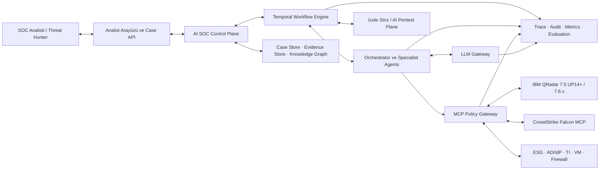
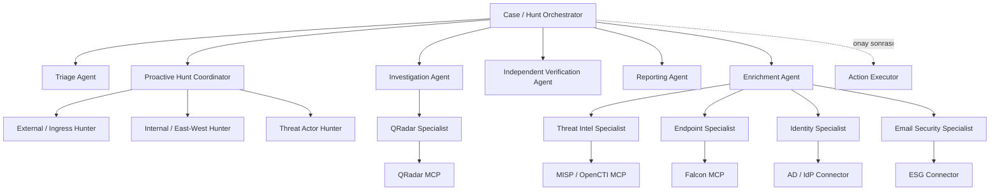
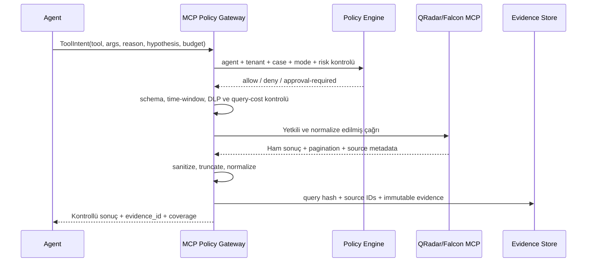
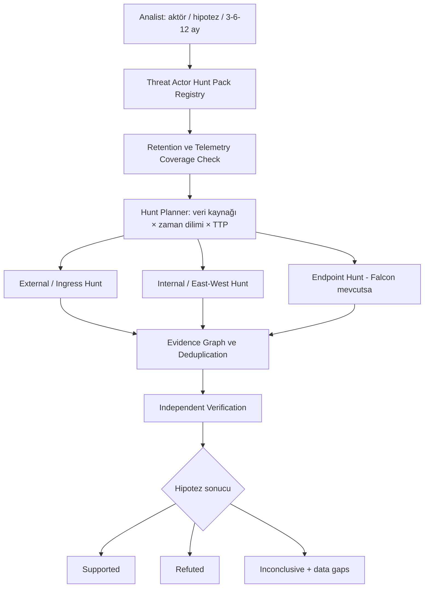
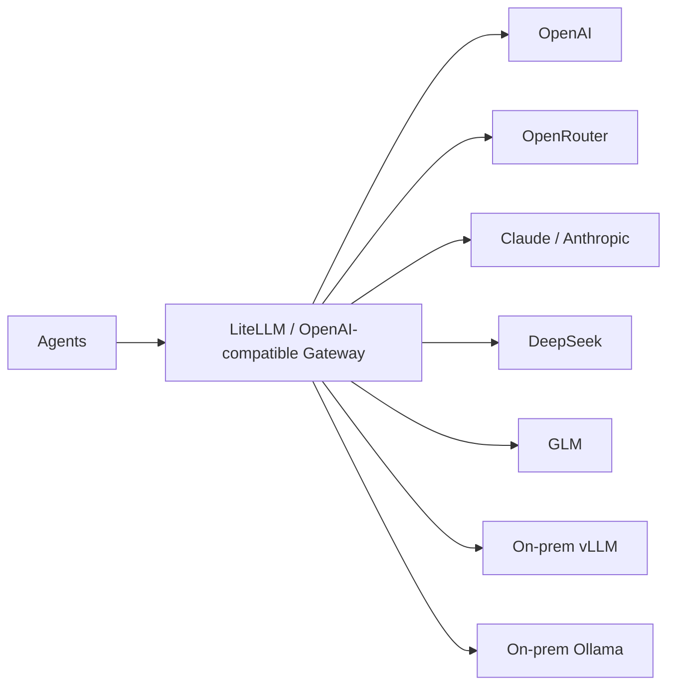

# AI SOC Platform Mimarisi

## 1. Amaç ve kapsam

Platformun amacı QRadar'ın korelasyon motorunun yerine geçmek değil; offense triage, soruşturma, kanıt toplama, proaktif threat hunting ve analist karar desteğini ajanlarla hızlandırmaktır.

İlk faz yalnızca QRadar ile konuşur. Yeni güvenlik ürünleri çekirdeğe gömülmez; MCP/connector ve specialist-agent olarak eklenir. Böylece Falcon, ESG, AD/IdP, firewall, MISP/OpenCTI, zafiyet yönetimi ve Strix benzeri pentest sistemleri mevcut ajan sözleşmelerini bozmadan sisteme katılabilir.

## 2. Tasarım ilkeleri

1. **Workflow ajan değildir.** Temporal vaka durumunu, retry, timeout, checkpoint ve human-in-the-loop beklemelerini yönetir. LLM yalnızca sınırlandırılmış karar düğümlerinde çalışır.
2. **Ajan aracı doğrudan çalıştırmaz.** Her çağrı MCP Policy Gateway tarafından doğrulanır ve kaydedilir.
3. **Tool yetkisi HTTP metoduna göre verilmez.** Örneğin Ariel araması POST kullansa bile semantik olarak read-only kabul edilir; yetki tool kimliği ve risk sınıfı üzerinden belirlenir.
4. **Kanıtsız iddia sonuç değildir.** Her finding; kaynak sistem, sorgu, event/flow/detection kimliği ve zaman aralığına bağlanır.
5. **Model sağlayıcısı uygulama kararlarını değiştirmez.** Ajanlar `soc-fast`, `soc-reasoning`, `soc-verifier` gibi mantıksal model adları kullanır.
6. **Üretim verisi varsayılan olarak on-prem kalır.** Bulut modellerine yalnızca sentetik veya kurum politikası uyarınca maskelenmiş veri gönderilir.
7. **Otonomi kademelidir.** İlk fazda ajanlar okur, araştırır ve önerir; değişiklik yapan aksiyonlar ayrı executor ve insan onayı gerektirir.
8. **Threat hunting tekrar üretilebilir olmalıdır.** Hipotez, hunt pack sürümü, veri kapsaması, sorgular ve sonuçlar kayıt altına alınır.

## 3. Sistem bağlamı



## 4. Mantıksal katmanlar

| Katman | Sorumluluk | Bağımlılık sınırı |
|---|---|---|
| Experience Plane | Vaka ekranı, hunt başlatma, onay ve analist feedback'i | İş mantığı içermez |
| Control Plane | Tenant, case, agent registry, policy, bütçe ve scheduling | Ürün API'sine doğrudan bağlanmaz |
| Workflow Plane | Temporal workflow, child workflow, retry, timer, approval wait | Deterministik kalır; ağ I/O activity üzerinden yapılır |
| Agent Plane | Orchestrator ve rol bazlı specialist agent'lar | Sadece verilen toolset'i görür |
| Tool Plane | MCP Policy Gateway, connector registry, action executor | Kimlik bilgileri yalnızca burada bulunur |
| Model Plane | LiteLLM gateway, provider routing, model registry | Agent sağlayıcı adı değil mantıksal model adı kullanır |
| Knowledge Plane | Runbook, ATT&CK, threat actor graph, hunt pack, geçmiş vakalar | Canlı operasyonel veri burada bayat kopya olarak tutulmaz |
| Evidence Plane | Finding, evidence, query ve coverage kayıtları | Her sonucun provenance zincirini korur |
| Assurance Plane | Test, replay, red-team, shadow ve release gate | Üretimden bağımsız çalışabilir |

## 5. Agent topolojisi

Orchestrator sınırsız bir agent swarm değildir. Hangi child workflow'un açılabileceği, eşzamanlılık, süre ve bütçe Temporal politikalarıyla sınırlandırılır.



### Agent sorumlulukları

| Agent | Sorumluluk | Varsayılan tool yetkisi |
|---|---|---|
| Orchestrator | Vakayı sınıflandırır, specialist seçer, bütçe dağıtır | Delegasyon ve vaka durumu; ürün sorgusu minimum |
| Triage | İlk önceliklendirme ve FP adayı | Offense, rule, asset okuma |
| Investigation | Hipotez üretme, timeline ve hedefli sorgu planı | Bütçeli QRadar aramaları |
| External Hunter | İnternetten içeri trafik, perimeter, exposed service ve ingress anomalileri | QRadar event/flow; gelecekte NDR, firewall ve ESG |
| Internal Hunter | East-west trafik, lateral movement, identity ve privilege anomalileri | QRadar flow/event; gelecekte Falcon ve IdP |
| Threat Actor Hunter | Seçilen grubun TTP'lerine göre 3/6/12 aylık hunt | Hunt pack'te tanımlı read-only araçlar |
| Verification | Bulguyu bağımsız sorgularla doğrular, çelişkileri işaretler | Read-only doğrulama araçları |
| Action Executor | Onaylanmış deterministik aksiyonu uygular | Ayrı servis kimliği; LLM kararı çalıştırmaz |
| Reporting | Kanıtlı vaka ve hunt raporu üretir | Evidence store okuma |

## 6. QRadar entegrasyonu

### Sürüm stratejisi

- Destek hedefi: QRadar 7.5 UP14 ve üzeri ile 7.6.x.
- Connector başlangıçta sunucunun desteklediği API sürümünü keşfeder.
- Her connector sürümü için desteklenen endpoint/tool capability matrisi tutulur.
- Agent API sürümü veya endpoint adı bilmez; `search_events`, `get_offense`, `get_rule_context` gibi platform capability'leri görür.
- QRadar MCP sürümü ve tool şemaları pinlenir; yükseltme contract testlerinden geçmeden üretime alınmaz.

### QRadar MCP profilleri

| Profil | Kullanım | Örnek yetenekler |
|---|---|---|
| `qradar-triage-read` | Triage agent | Offense, rule, asset ve sınıflandırma okuma |
| `qradar-investigate-read` | Investigation agent | Ariel event/flow search, search status/result |
| `qradar-hunt-read` | Hunter agent'lar | Zaman dilimli ve kota kontrollü geniş hunt sorguları |
| `qradar-write-proposed` | Normal agent'lar | Gerçek tool değildir; yalnızca action proposal üretir |
| `qradar-action-executor` | Onay sonrası executor | Note/reference set gibi açıkça izinli işlemler |

Genel amaçlı `execute_any_api`, delete, offense close veya limitsiz AQL aracı normal ajan toolset'ine verilmez.

## 7. MCP Tool Plane



### ToolIntent zorunlu alanları

- `case_id` veya `hunt_id`
- `agent_role`
- `tool_id` ve tool schema sürümü
- Katı şemaya uyan parametreler
- Çağrı gerekçesi ve bağlı hipotez
- Beklenen kanıt türü
- Zaman aralığı
- Tahmini maliyet/bütçe sınıfı
- Read, write veya destructive risk sınıfı

### Gateway kontrolleri

- Agent ve görev bazlı exact allowlist
- JSON Schema yanında semantik doğrulama
- Tenant/domain izolasyonu
- Zorunlu zaman aralığı ve sonuç limiti
- Query concurrency, timeout ve cache
- İç IP, hostname, kullanıcı ve PII için egress/DLP politikası
- Secret isolation; token ve sertifikalar LLM bağlamına girmez
- Idempotency anahtarı ve duplicate-call engeli
- Sonuç boyutu sınırı, pagination ve kontrollü özetleme
- Her çağrı için immutable audit ve evidence kaydı

## 8. Proaktif threat hunting mimarisi

Proaktif hunt bir alarmdan değil, açık ve test edilebilir bir hipotezden başlar.



### Threat Actor Hunt Pack

Her grup için sürümlenen bir hunt pack bulunur:

- Grup adı, alias'lar ve ilişkili kampanyalar
- MITRE ATT&CK technique/sub-technique eşlemeleri
- Bilinen IOC'ler ve geçerlilik tarihleri
- Davranışsal analitikler ve hipotez şablonları
- QRadar AQL şablonları; ileride Falcon/NGSIEM sorgu şablonları
- Gerekli telemetry kaynakları ve minimum retention
- Beklenen benign açıklamalar ve false-positive koşulları
- Doğrulama adımları ve confidence kuralları
- Kaynak/provenance ve son güncelleme tarihi

Pack içindeki IOC'ler tek başına karar verdirmez. Süresi geçmiş IOC ile davranışsal TTP sinyalleri ayrılır; nihai finding kanıt zinciri ister.

### 3, 6 ve 12 aylık hunt

Tek bir dev sorgu çalıştırılmaz. Hunt Planner süreyi veri kaynağı ve sorgu maliyetine göre günlük/haftalık/aylık dilimlere ayırır. Her dilim:

1. Retention kapsamını doğrular.
2. Ayrı bütçe ve timeout ile çalışır.
3. Sonuç ve query hash'ini checkpoint eder.
4. Tekrar çalışmada cache/idempotency kullanır.
5. Eksik dönemleri `data_gap` olarak işaretler.
6. Sonuçları varlık, kullanıcı, IP, process ve technique üzerinden evidence graph'ta birleştirir.

"12 ay tarandı" ifadesi yalnızca bütün zaman dilimleri ve zorunlu telemetry kaynakları kapsandıysa kullanılabilir.

## 9. Model plane



Mantıksal model rolleri:

| Model adı | Kullanım |
|---|---|
| `soc-fast` | Sınıflandırma, alan çıkarma, kısa özet |
| `soc-reasoning` | Soruşturma planı, hipotez ve tool seçimi |
| `soc-verifier` | Bağımsız finding/evidence doğrulaması |
| `soc-report` | Analist ve yönetici raporu |
| `soc-embed` | Runbook, ATT&CK ve geçmiş vaka retrieval |

Provider seçimi kodda yapılmaz. Her model/prompt/provider değişikliği aynı assurance suite üzerinden geçirilir.

## 10. Vaka ve kanıt modeli

Temel varlıklar:

```text
Case -> Hypothesis -> InvestigationStep -> ToolCall -> Evidence -> Finding
Hunt -> HuntPackVersion -> TimeSlice -> Coverage -> Evidence -> Finding
Finding -> Verification -> Verdict -> RecommendedAction
RecommendedAction -> Approval -> ActionExecution -> ActionResult
```

Finding durumu yalnızca şu değerlerden biri olur:

- `supported`: Yeterli ve doğrulanmış kanıt var.
- `refuted`: Hipotezi çürüten yeterli kanıt var.
- `inconclusive`: Veri, retention veya telemetry yetersiz; kesin karar yok.

Confidence skoru kanıtın yerine geçmez. Kanıtı olmayan yüksek confidence kabul edilmez.

## 11. Otonomi ve aksiyon güvenliği

| Seviye | Yetki |
|---|---|
| L0 | Okuma, araştırma, rapor ve aksiyon önerisi |
| L1 | Düşük riskli ve geri alınabilir işlemler; açık policy ile |
| L2 | Yüksek riskli aksiyonu hazırlar; analist onayı gerekir |
| L3 | Sadece ölçülmüş ve açıkça izinli playbook'larda otomasyon |

İlk üretim fazı L0'dır. Host izolasyonu, hesap kilitleme, firewall block, offense close ve benzeri işlemler agent toolset'inde bulunmaz. Onay, eylemin tam parametrelerine ve süresine bağlanır; onaydan sonra parametre değişirse yeniden onay gerekir.

## 12. Strix ve AI pentest izolasyonu

Pentest işleri SOC soruşturma worker'larıyla aynı güven sınırında çalışmaz:

- Ayrı Temporal task queue ve worker pool
- Ayrı ağ segmenti, servis kimliği ve secret seti
- Açık hedef/scope sözleşmesi
- Kill switch, süre ve trafik bütçesi
- Varsayılan olarak üretim hedeflerine erişim yok
- Bulgular doğrudan aksiyona dönüşmez; evidence ingestion ve doğrulama sürecinden geçer

## 13. Dağıtım bölgeleri

| Bölge | İçerik |
|---|---|
| SOC application zone | API, UI, Temporal workers, agent runtime |
| Integration zone | MCP Policy Gateway ve connector süreçleri |
| Data zone | PostgreSQL, evidence store, object store, knowledge graph |
| AI zone | LiteLLM, vLLM/Ollama, embedding ve reranker |
| Security tools zone | QRadar, Falcon ve diğer ürünler |
| Pentest isolated zone | Strix ve kontrollü test runner'ları |

Servisler mTLS/service identity ile konuşur. Ağ erişimi deny-by-default olur; model worker'ları güvenlik ürünlerine doğrudan erişemez.

## 14. Gözlemlenebilirlik

Her case/hunt tek bir trace olarak izlenir. Alt span'ler:

- Temporal workflow ve activity
- Agent/sub-agent çalışması
- Model çağrısı
- ToolIntent ve policy kararı
- MCP tool çağrısı
- Sorgu ve pagination
- Finding doğrulaması
- Human approval
- Action execution

Trace üzerinde prompt/model/toolset/policy/hunt-pack sürümleri bulunur. Hassas veri loglanmadan önce redaction uygulanır. Ayrıntılı değerlendirme ve release gate tasarımı [agent harness dokümanında](agent-harness.md) tanımlanmıştır.

## 15. Fazlandırma

| Faz | Kapsam | Otonomi |
|---|---|---|
| 0 | Architecture, tool contracts, evaluation corpus, fake MCP | Yok |
| 1 | QRadar MCP, triage, investigation, verification | L0 |
| 2 | External/internal proactive hunters ve actor hunt packs | L0 |
| 3 | Falcon MCP ve endpoint specialist | L0-L1 |
| 4 | ESG, identity, TI, VM ve controlled action executor | L1-L2 |
| 5 | İzole Strix/pentest plane ve seçili playbook otomasyonu | Policy bazlı |

Bir faz ancak harness release gate'lerini geçtiğinde sonraki otonomi seviyesine ilerler.

