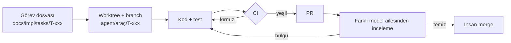

# Çoklu Kodlama Ajanıyla Geliştirme

Bu repoda birden fazla kodlama ajanı çalışır: Codex, Claude Code, OpenCode üzerinden DeepSeek ve GLM gibi modeller. Bu doküman, ajanların birbirinin işini bozmadan paralel çalışmasını sağlayan düzeni tanımlar (T-15).

## Hangi araç hangi dosyayı okur

| Araç | Okuduğu dosya |
|---|---|
| Codex | `AGENTS.md` |
| OpenCode (DeepSeek, GLM vb.) | `AGENTS.md` |
| Claude Code | `CLAUDE.md`; o da `@AGENTS.md` ile ortak kuralları içe aktarır |
| Diğer araçlar | `AGENTS.md`; araç başka bir dosya adı bekliyorsa ayarlarından `AGENTS.md`'ye yönlendirilir |

Ortak kurallar yalnızca `AGENTS.md`'de tutulur. Araca özel dosyalara yalnızca o araca özgü notlar yazılır; kurallar kopyalanmaz.

## İlkeler

1. **Önce sözleşme.** `packages/contracts` ilk iş olarak yazılır ve insan onayıyla dondurulur. Diğer paketler bu sözleşmelere karşı paralel geliştirilir.
2. **Bir görev, bir branch, bir worktree.** Her ajan tek bir görev üzerinde, kendi branch'inde ve kendi worktree'sinde çalışır.
3. **İzinli dizinler.** Görev dosyası ajanın dokunabileceği dizinleri listeler. Ajan bunların dışına çıkmaz.
4. **Sözleşme değişikliği insan kararıdır.** Ajan sözleşmede değişiklik gerektiğini fark ederse kodlamayı durdurur ve PR açıklamasına "Sözleşme değişikliği talebi" yazar.
5. **Hakem CI'dır.** Hangi model yazmış olursa olsun, CI geçmeyen PR merge edilmez.
6. **Çapraz inceleme.** PR'ı yazan modelden farklı aileden bir model inceler. Merge'i insan yapar.

## Görev akışı



Paralel çalışma için worktree örneği:

```bash
git worktree add ../ais0c-T-005 -b agent/codex/T-005
git worktree add ../ais0c-T-007 -b agent/opencode-deepseek/T-007
```

Her ajan kendi worktree dizininde başlatılır. Görev merge edildikten sonra worktree silinir (`git worktree remove`).

## Görev dosyası

Görevler `docs/impl/tasks/` altında tutulur. Şablon: [tasks/_template.md](tasks/_template.md). Görevi yazan insandır; ajana yalnızca görev dosyasının yolu verilir.

İyi bir görev:

- Tek bir paketin veya tek bir dikey dilimin içinde kalır.
- Kabul kriterleri test olarak yazılabilir.
- Hangi doküman bölümlerinin okunacağını açıkça listeler.
- Yarım günden birkaç güne kadar sürer. Daha büyükse bölünür.

## Model atama rehberi

| Görev türü | Örnekler | Öneri |
|---|---|---|
| Güvenlik ve çekirdek | `contracts`, `policy`, AQL Guard, `executor`, `workflows`, gateway plugin'leri | En güçlü model; insan incelemesi zorunlu |
| Entegrasyon | qradar-mcp fork'u, Falcon connector'ı, LiteLLM ayarları | Güçlü model; lab QRadar'da contract testi zorunlu |
| Tekrarlı işler | API endpoint'leri, arayüz ekranları, migration'lar, fixture üretimi | Hızlı ve ucuz modeller |
| Prompt ve eval | Ajan prompt'ları, harness senaryoları | Prompt'u yazan model ile değerlendiren model farklı olur |

## Çakışmaları önleme

- **Sözleşmeler:** `packages/contracts` değişikliği yalnızca kendi görevinde yapılır, başka bir değişiklikle karıştırılmaz.
- **Migration'lar:** Aynı anda yalnızca bir görev migration ekler. Alembic'te iki head oluşursa merge'den önce birleştirilir.
- **Bağımlılıklar:** `uv.lock` çakışmasını önlemek için aynı anda yalnızca bir görev yeni bağımlılık ekler. Rebase sırasında lock dosyası elle birleştirilmez; `uv lock` ile yeniden üretilir.
- **Arayüz metinleri:** Türkçe metinler tek i18n dosyasındadır. İki görev aynı anahtarı değiştiriyorsa ikincisi rebase eder.

## CI kontrolleri

Her PR'da:

1. ruff (lint ve format)
2. pyright
3. pytest (unit ve contract testleri)
4. import-linter ([repo-structure.md](repo-structure.md) bağımlılık kuralları)
5. Sözleşme snapshot testi: `packages/contracts` JSON Schema çıktısı değiştiyse PR'da `contract-change` etiketi ve insan onayı aranır
6. Sağlayıcı adı kontrolü: `config/litellm/` ve `config/models/` dışında model sağlayıcı adı geçmemeli. İstisnalar `packages/agents/src/ais0c_agents/llm.py` ve bu dosyanın client bağımlılığını tanımlayan `packages/agents/pyproject.toml` ([repo-structure.md](repo-structure.md))
7. gitleaks secret taraması
8. Frontend: lint, typecheck, test; API tipleri OpenAPI'den yeniden üretildiğinde fark çıkmamalı

## PR şablonu

PR'lar [.github/pull_request_template.md](../../.github/pull_request_template.md) ile açılır. Şablon şunları sorar: görev numarası, ne değişti, nasıl test edildi, spesifikasyondan sapmalar, açık sorular, kullanılan araç ve model.

## Faz 0 görev listesi

Her görev için ayrı bir görev dosyası açılır; bu tablo planı ve bağımlılıkları gösterir.

| Görev | Kapsam | İzinli dizinler | Bağımlı olduğu | Paralel grup |
|---|---|---|---|---|
| T-001 | Repo iskeleti: uv workspace, boş paketler, ruff/pyright/pytest/import-linter ayarları, CI. İş mantığı yok. | Kök ayar dosyaları, `packages/*/`, `services/api/`, `services/worker/` ve `harness/` iskeletleri, `.github/workflows/` | — | A |
| T-002 | `contracts` v0.1: [contracts.md](contracts.md)'deki modeller, JSON Schema dışa aktarımı, snapshot testi | `packages/contracts/` | T-001 | B |
| T-003 | Dev compose: Temporal, Postgres + pgvector, LiteLLM (OpenRouter ve on-prem vLLM), OTel collector | `deploy/compose/`, `config/litellm/`, `config/models/`, `tests/deploy/` | T-001 | B |
| T-004 | `storage`: [data-model.md](data-model.md) tabloları ve ilk migration | `packages/storage/` | T-002 | C |
| T-005 | `querylang` ve `policy`: Sigma → AQL derleme, AQL Guard, untrusted veri sarmalama; negatif testler | `packages/querylang/`, `packages/policy/`, `config/sigma/` | T-002 | C |
| T-006 | qradar-mcp fork'u: sürüm keşfi, profiller, lab QRadar contract testleri | Ayrı repo | — | A |
| T-007 | Gateway spike: ContextForge değerlendirmesi; çıktı bir karar raporu | `docs/impl/spikes/` | T-006 | C |
| T-008 | Sentetik log üretici ve ilk lab senaryoları | `harness/` | T-001 | B |
| T-009 | `agents`: Triage ajanı, prompt yükleme, `TestModel` ile testler | `packages/agents/`, `prompts/triage/`, `prompts/_shared/`, `config/agents/` | T-002, T-005 | D |
| T-010 | `workflows`: `OffenseIntake` ve `CaseWorkflow` iskeleti, Temporal test ortamıyla | `packages/workflows/`, `packages/activities/`, `services/worker/` | T-002, T-004 | D |
| T-011 | MCP Policy Gateway: spike kararına göre profil yetkisi, ToolIntent doğrulama, AQL Guard, alan filtresi, kanıt kaydı | `services/mcp-gateway/`, `packages/policy/`, `config/policies/`, `config/connectors/`, `packages/agents/` (yalnızca gateway client) | T-004, T-005, T-006, T-007 | E |
| T-012 | Lab'da uçtan uca: offense → Triage → gateway → lab QRadar → kanıt. Faz 0'ın çıkış kriteri. | `packages/activities/`, `packages/workflows/`, `services/worker/`, `tests/e2e/`, `config/agents/` | T-003, T-008, T-009, T-010, T-011 | F |

Aynı paralel gruptaki görevler, bağımlılıkları merge edildikten sonra aynı anda farklı ajanlara verilebilir. Görev dosyaları: [tasks/](tasks/).

Faz 0'dan sonraki görevler (Faz 0 kapanışı, Faz 1, canary öncesi): [pipeline.md](pipeline.md).
